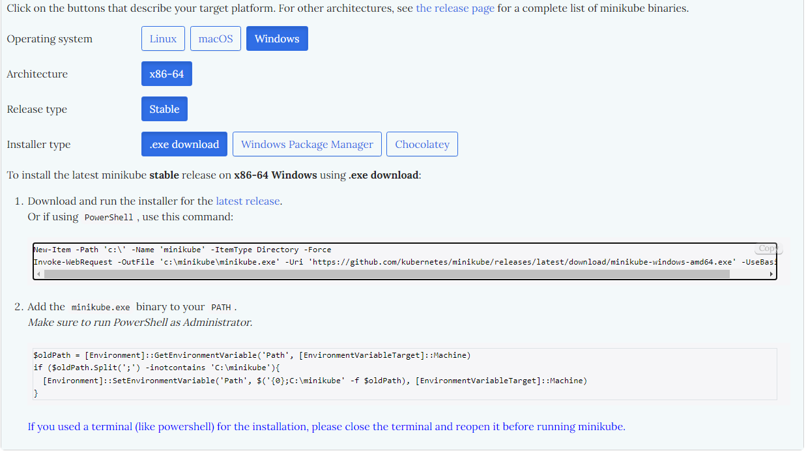
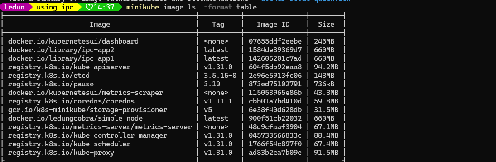
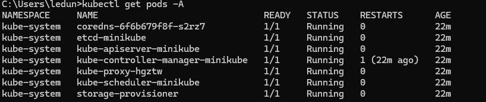

#### Install Docker Desktop

First you can follow this video to install docker desktop in your own machine
[Install Docker Desktop Tutorial](https://www.youtube.com/watch?v=5RQbdMn04Oc)

#### Install Minikube

Then follow this step to install minikube in your own machine depend on your operating system.

[Step to install Minikube](https://minikube.sigs.k8s.io/docs/start/?arch=%2Fwindows%2Fx86-64%2Fstable%2F.exe+download)



#### Verify minikube installation

```shell
minikube start --driver=docker

```

For windows to config for local image

```shell
& minikube -p minikube docker-env --shell powershell | Invoke-Expression
```

For linux, macos

```shell
eval $(minikube -p minikube docker-env)

```

[Refer to this link for more information](https://www.baeldung.com/ops/docker-local-images-minikube)

This command will switch your local docker registry to the minikube cluster docker registry.

**To revert back**

```shell
# Revert back for windows
& minikube -p minikube docker-env --unset --shell powershell | Invoke-Expression

# Revert back for linux, macos
eval $(minikube -p minikube docker-env --unset)
```

At this point, you must restart your terminals and your IDEs.

You can verify the docker images in minikube by running this command

```shell
minikube image ls --format table
```



```shell
minikube status
```

#### Install kubectl

You can follow this step to install kubectl in your own machine depend on your operating system.
[Step to install kubectl](https://kubernetes.io/docs/tasks/tools/)

#### Verify all installation

```shell
kubectl get pods -A
```


