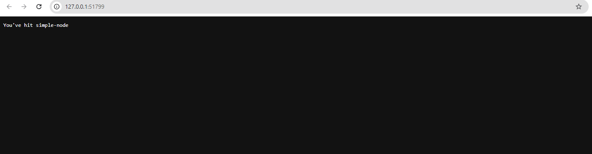

**Content:**

- [Create Kubernetes Cluster on Google Cloud](#create-kubernetes-cluster-on-google-cloud)

If you would like to create Kubernetes Cluster on Google Cloud, you can follow these steps:

```shell
gcloud container clusters create kubia --num-nodes 3 --machine-type f1-micro
```

- The command will create a Kubernetes cluster with 3 nodes, each node is a f1-micro machine type.
- You use `kubectl` to interact with the Kubernetes cluster.


In this demo I use Minikube to create a local Kubernetes cluster.

```shell
minikube start
```

- This command will create a single-node Kubernetes cluster on your local machine.

To run the simple node application, you can use the following command:

```shell
kubectl run simple-node --image=ledungcobra/simple-node --port=8080
```

#### Introduction to Pods

- **What exactly is a Pod?**
- A Pod is the smallest deployable unit in Kubernetes.
- It contains one or more containers that are running on the same worker node and in the same linux namespace.

{}
A linux namespace is an abstraction that isolates the kernel resources of a group of processes from each other.
{}

To check status of pods, you can use the following command:

```shell
kubectl get pods
```


To access the application, you can use the following command:

```shell
kubectl port-forward pods/simple-node 8080:8080
```


Now you can access the application by navigating to `http://localhost:8080` in your favorite web browser.


Alternatively, we can expose service to access the application.

```shell
kubectl expose pod simple-node --type=NodePort --port=8080
minikube service simple-node --url
```




```shell
kubectl get svc
```

{}
In Kubernetes, we have some common abbreviations:

- `svc` is the abbreviation for service.
- `pods` is the abbreviation for pods.
- `rc` is the abbreviation for replication controller.
- `rs` is the abbreviation for replication set.
- `pv` is the abbreviation for persistent volume.
- `pvc` is the abbreviation for persistent volume claim.
- `cm` is the abbreviation for config map.
- `ing` is the abbreviation for ingress.
- `ns` is the abbreviation for namespace.
- `deploy` is the abbreviation for deployment.
  {}


#### Type of Services

- `NodePort` means that we can access the application from outside the cluster through the node's IP address and the port in range 30000-32767.

```yaml
apiVersion: v1
kind: Service
metadata:
  name: simple-node-service
spec:
  type: NodePort
  selector:
    app: simple-node
  ports:
    - protocol: TCP
      port: 8080
      targetPort: 8080 # The port that the application is listening on
      nodePort: 30080 # You can specify a port in the range 30000-32767 or let Kubernetes assign one automatically
```

- `ClusterIP` means that the service is only accessible within the cluster. Other services in the same cluster can access this service through its cluster IP address.

```yaml
apiVersion: v1
kind: Service
metadata:
  name: simple-node-clusterip
spec:
  type: ClusterIP
  selector:
    app: simple-node
  ports:
    - protocol: TCP
      port: 8080 # The port that the service will expose
      targetPort: 8080 # The port that the application is listening on
```

- `LoadBalancer` means that the service is accessible from outside the cluster through a cloud provider's load balancer.

```yaml
apiVersion: v1
kind: Service
metadata:
  name: simple-node-loadbalancer
spec:
  type: LoadBalancer
  selector:
    app: simple-node
  ports:
    - protocol: TCP
      port: 8080 # The port that the service will expose
      targetPort: 8080 # The port that the application is listening on
```
