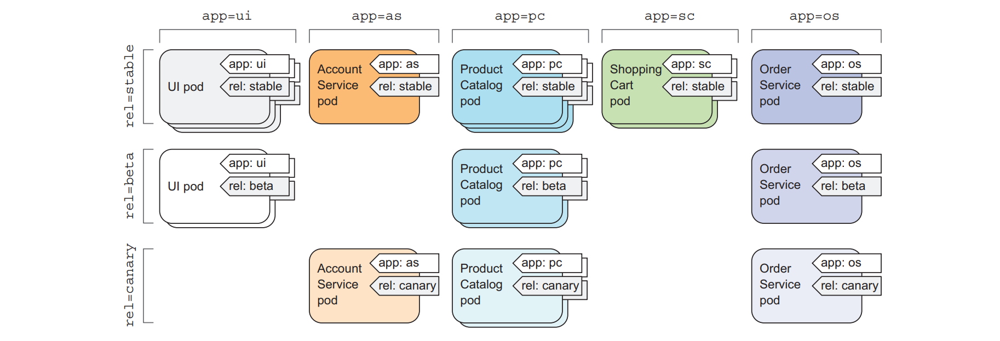
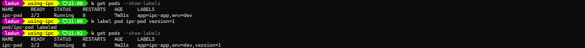
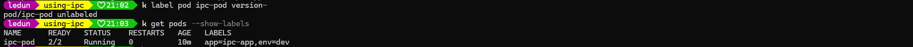
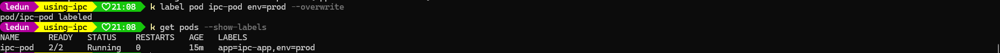
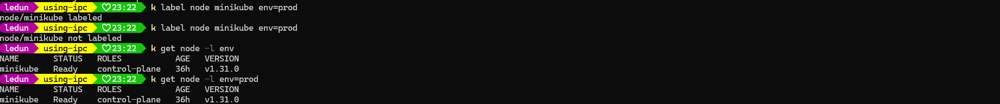
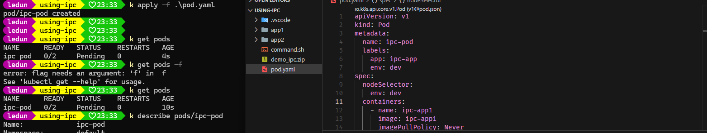
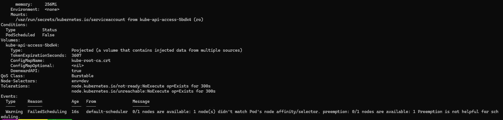
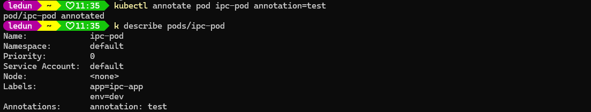

**Content:**

- [Decide wheather containers should be grouped together in a pod or not](#decide-wheather-containers-should-be-grouped-together-in-a-pod-or-not)

- [Understand pods](#understand-pods)

- [How to define pod using YAML or JSON descriptor](#how-to-define-pod-using-yaml-or-json-descriptor)

- [Labels and selectors](#labels-and-selectors)

- [Schedule pods on specific nodes](#schedule-pods-on-specific-nodes)

- [Annotations](#annotations)

- [Namespaces to virtualy separate cluster for different teams](#namespaces-to-virtualy-separate-cluster-for-different-teams)


#### Decide wheather containers should be grouped together in a pod or not

- A pod is a group of one or more containers, with shared storage and network resources. But it is common that a pod has only one container. The key take away is that if a pod contains multiple containers, all the containers that run on the same host machine can access the shared storage and network resources.


- There is one question that arises: **Why don't we just use containers directly?**
  The answer for this is that if you have multiple processes that either communicate with each other through IPC (Inter-Process Communication) or through locally stored files, which require them to run on the same machine.

Containers are designed to run only one process per container unless you are spawn child processes. If you run multiple unrelated process on the same container it can mix up your log since all of these processes will log to the same standard output. Therefore, you need to run one process per container. That's how Docker and Kubernetes are meant to be used.

#### Understand pods

- Because you are not group containers in group, so you need a way to bind containers together as a single unit. This is where pods come into play.
- A pod of containers allow you to run closely related processes together and provide them with the same environment as if they were running in a single container, while keeping them somewhat isolated from each other. By this way you can get the best of both worlds: you can leverage the feature that container provide while giving the processes the illusion of running together.

**The partial isolation between containers in same pod**

- The containers in pods share the same **Linux namespace** because all containers of pod un under the same Network, UTS namespaces. (Linux namespaces). They all share the same hostname and network interfaces. Also, all containers in a pod share the same se of IPC namespace and can communicate through IPC.

- Regarding filesystem, each container has its own filesystem. The filesystem of a container is isolated from other containers. However, it's posible to have them share file directories using Kubernetes concept called `Volume` we will see later.
- Containers in a pod run in the same Network namespace, they share the same IP address and port space, this means that containers in the same pod should avoid to use the same port, because they will collide with each other. All the containers in a pod share the same loopback network interface.

**Flat inter-pod network**

- All pods in Kubernetes cluster are using a flat network model, once a pod has IP address of other node it can communicate directly with other pods without NAT between them.
- Communicate between pods is simple since it doesn't matter if a pod is on the same node or on a different node, they can communicate with each other using their IP address.


- To demonstrate this, I've created two simple applications using Node.js comunicate through IPC using loopback network.
  You can find the source code [here](files/demo_ipc.zip).

{}
If you got error when running the application, make sure to build the image first using docker build command. You can troubleshooting the issue by using `kubectl describe pod ipc-pod`. If you are encounter the error ErrImagePull... 100% need to set up local repository for minikube please refer to this [1 - Setup a local environment K8s](../1%20-%20Setup%20a%20local%20environment%20K8s/_index.md)
{}

**We can have multiple containers in a pod, there are some reason to do so:**

- **Sidecar container**: the container that periodically download content from an external source and store it in the webserver directory.


Answer three questions when you decide to put containers in the same pod:

- Do they need to run together or can run on separate hosts.
- Do they represent a single entity or independent components.
- Must they be scaled together or can run independently.

There are some pattern that help you memorize this:


#### How to define pod using YAML or JSON descriptor

- Pods and other kubernetes objects are defined using YAML or JSON.
- By using `kubectl apply -f <filename>.yaml` this will make a REST call to Kubernetes API to create the object if it doesn't exist, otherwise it will update the existing object.
- To use all features of Kubernetes, you need to use YAML or JSON. It's common to see people out there using YAML because it's more human-readable.

[Kubernetes API Reference](https://kubernetes.io/docs/reference/)

**Main part of Kubernetes POD resource definition**

- Metadata: including `name`, `namespace`, `labels` and `annotations`.
- Spec: including description of pod's content like pod's containers, volumes and other data.
- Status: including current infomation about running pod such as what condition of the pods is in, the description and status of each container, pod internal IP and other basic information.

```yaml
apiVersion: v1 # API version
kind: Pod # Type of the resource
metadata:
  name: kubia-manual # Name of the pod
spec:
  containers:
    - image: luksa/kubia # Reference to Docker image
      name: kubia # Name of the container inside the pod
      ports:
        - containerPort: 8080 # Expose port 8080 of the container
```

{}
Specify `containerPort` is optional, the client can connect to any container in the pod. But it useful for other people who read your YAML file
{}

{}
You can explain the component in K8S using command `kubectl explain pod.spec.containers`
{}

- To create pod name simply run either one of the following command:

```shell
kubectl apply -f <filename>.yaml
kubectl create -f <filename>.yaml
```

- To get the pod manifest, you can use the following command:

```shell
kubectl get pod <pod-name> -o yaml
kubectl get pod <pod-name> -o json
```

- To see logs of the pod, you can use the following command:

```shell
kubectl logs <pod-name>
```

If you are using multi container in a pod, you can use the following command to get the logs of a specific container:

```shell
kubectl logs <pod-name> -c <container-name>
```

{}
Note that you can only retrieve logs of a container when the pod is still running. If the pod is terminated, the logs will be deleted. But this issue can be resolve by set up centralized, cluster-wide logging solution which will be discussed in the later section. #TODO
{}

- To talk to a specific pod without go through `service` or `ingress` you can use the following command:

```shell
kubectl port-forward <pod-name> 8080:8080
```


#### Labels and selectors

- When the number of pods in your cluster grow, it will be useful to classify and organize them using labels.
- Label are simple, but incredible powerful, Kubernetes feature. A label is a key-value pair that is attached to an object. A resource can have multiple labels. You can create label when create resource from manifest or you can add or modify label of existing resource using `kubectl label` command.

- Suppose we have 3 environment: stable, beta, canary. We want to label the pod to indicate which environment it belongs to.
- Also, we want to label pod to indicate its functionality: ui, account service, product catalog, shopping cart, ...
- By doing so we can organize our pods horizontally and vertically.



- This command is useful to see the label of the pod.

```shell
kubectl get pods --show-labels
```


- To list some labels, you can specify them with -L option.

```shell
kubectl get pods -L <label-key1>,<label-key2>
```


- To filter pods by label, you can use the following command:

```shell
kubectl get pods -l <label-key>=<label-value>
```


- To add label to a pod, you can use the following command:

```shell
kubectl label pod <pod-name> <label-key>=<label-value>
```



- To remove label from a pod, you can use the following command:

```shell
kubectl label pod <pod-name> <label-key>-
```



- To overwrite a label, you can use the following command:

```shell
kubectl label pod <pod-name> <label-key>=<label-value> --overwrite
```



- To list all resource having a specific label, you can use the following command:

```shell
kubectl get all -l <label-key>
```


- To list all resource not having a specific label, you can use the following command:

```shell
kubectl get all -l 'expression'
```

- The expression is a string that follows the format of a label selector.

```code
- Expression can be one of the followings:
  - '!<label-key>'
  - '<label-key>!=<label-value>'
  - '<label-key> in (<label-value1>,<label-value2>,...)'
  - '<label-key> notin (<label-value1>,<label-value2>,...)'
```


**Using labels and selectors to constrain pod scheduling**

- The pods by default scheduled randomly across the nodes in the cluster. But in some case, you want to control which pod runs on which node maybe you have many different types of nodes (some having SSD installed, some have GPU, ....). You should not specific tell what node a pod should schedule on, since it will cause pod couple to a specific node. But if you want to do so you can delegate this job to Kubernetes to schedule your to by selecting the node that matches those requirements. This can be done through node label and node label selector.

**Label nodes**

- To label nodes, you can use the following command:

```shell
kubectl label node <node-name> <label-key>=<label-value>
```



- The same pattern like labeling pod, you can label nodes with multiple labels.

- The formular for all resource that support label selector:

```shell
kubectl label <resource> <label-key>=<label-value>
kubectl get <resource> -l <label-key>=<label-value>
kubectl get <resource> -l 'expression'
kubectl label <resource> <label-key>- # Remove label from resource
```

- The expression is a string that follows the format of a label selector.

```code
- Expression can be one of the followings:
  - '!<label-key>'
  - '<label-key>!=<label-value>'
  - '<label-key> in (<label-value1>,<label-value2>,...)'
  - '<label-key> notin (<label-value1>,<label-value2>,...)'
```

#### Schedule pods on specific nodes

- To schedule a pod on a specific node, you can use the following command:

```yaml
apiVersion: v1
kind: Pod
metadata:
  name: kubia-gpu
spec:
  nodeSelector:
    gpu: "true" # This will schedule to the node that has the label
  containers:
    - image: luksa/kubia
      name: kubia
```

- If the `nodeSelector` have more than one label, the pod will be scheduled to the node that has all the labels.

- If we don't have any node that match all the labels, the pod will be pending.
  

- Checking statuc of pods

```shell
k describe pods/ipc-pod
```



- The image show that there is no node in the cluster that match the `env=dev` label so that the pod is pending forever.

#### Annotations

- In addtion to labels, pods and other objects can also contain annotations. Annotations are similar to labels, but they hold identifying information rather than descriptive information. They can't be used to group objects like the way labels can. The objects can selected through label selectors, On the other hand, annotation can hold much larger

```shell
kubectl get po kubia-zxzij -o yaml
```

```yaml
apiVersion: v1
kind: pod
metadata:
  annotations:
    kubernetes.io/created-by: |
      {"kind":"SerializedReference", "apiVersion":"v1",
       "reference":{"kind":"ReplicationController", "namespace":"default", ...
```

The annotation `kubernetes.io/created-by` is large, it holds JSON data can hold large blobs of data up to 256KB in total.

- To add annotation to a pod, you can use the following command:

```shell
kubectl annotate pod <pod-name> <annotation-key>=<annotation-value>
```

```shell
kubectl annotate pod ipc-pod annotation=test
```



#### Namespaces to virtualy separate cluster for different teams

- Allows you to organize your cluster into virtual clusters. This means that you can redeclare same resource name without conflict between multiple namespaces.

{}
The node is not namespaced
{}

**Useful commands**

```shell
kubectl get ns # List all namespaces
kubectl create ns <namespace-name> # Create a new namespace
kubectl delete ns <namespace-name> # Delete a namespace
kubectl config view --minify --output 'jsonpath={..namespace}' # Show current namespace I'm in
kubectl config set-context <context-name> --namespace=<namespace-name> # Set the namespace for the current context
kubectl get <resource> -n <namespace-name> # Get pods in a specific namespace
```

- Manifest to create namespace

```yaml
apiVersion: v1
kind: Namespace
metadata:
  name: my-namespace
```

- To create object that tight to a specific namespace

```shell
kubectl create -f <manifest-filename.yaml> -n <namespace>
```

**Contexts**

If using namespace you always need to specify namespace, to avoid this you can set the namespace as default namespace. But we can use Context to switch between namespace without specify namespace every time.

Create new context

```shell
kubectl config set-context <context-name> --namespace=<namespace-name>

```

List all contexts

```shell
kubectl config get-contexts
```

Switch context

```shell
kubectl config use-context <context-name>
```

Delete context

```shell
kubectl config delete-context <context-name>
```

**Understand the isolation provided by namespaces**

- The namespaces offer virtual isolation. But the resource in other namespace is still able to connect to other pod in other namespace if it has IP address.

{}
**Be careful when delete namespace**: When you delete a namespace, all the resources in that namespace will be deleted.
{}

- If you want to delete all resource but want to keep namespace for future use, you can use the following command:

```shell
kubectl delete all --all -n <namespace-name>
```