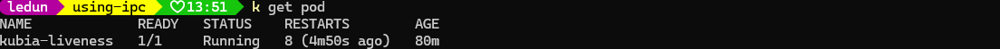
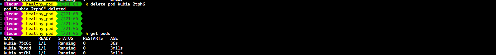

**Content:**

- [Keep pods healthy](#keep-pods-healthy)

- [Running multiple instances of same pod](#running-multiple-instances-of-same-pod)

- [Automatically rescheduling pods ater a node fails](#automatically-rescheduling-pods-ater-a-node-fails)

- [Scaling pods horizontally](#scaling-pods-horizontally)

- [Running system-level pods on each cluster node](#running-system-level-pods-on-each-cluster-node)

- [Running batch jobs](#running-batch-jobs)

- [Scheduling jobs to run periodically or once in the future](#scheduling-jobs-to-run-periodically-or-once-in-the-future)

#### Keep pods healthy

- Supose we have a Java application running in a pod. We got two things: JVM, java application. In case of JVM crash, the kublet on that node will restart the pod. But if the java application crash but JVM is still running, the kublet will not restart the pod.

**Liveness probe**

Kubernetes can check if a container is still alive by using liveness probe. You can set liveness probe in the pod definition and k8s will periodically check if the container is still alive and restart the container if it fails.

- Protocols supported: HTTP, TCP and command.
  - HTTP GET probe perform get request on container's IP address and port. If the response code is 2xx or 3xx. THe probe is considerd successful.
  - TCP socket probe try to open a socket on container's IP address and port. If the socket is opened, the probe is considerd successful.
  - Command probe run command inside the container. If the command return 0, the probe is considerd successful.

```yaml
apiVersion: v1
kind: Pod
metadata:
  name: kubia-liveness
spec:
  containers:
    - name: kubia
      image: luksa/kubia-unhealthy
      livenessProbe:
        httpGet:
          path: /
          port: 8080
        initialDelaySeconds: 300 # wait 300 seconds before starting the probe
        periodSeconds: 20 # check every 20 seconds
        timeoutSeconds: 2 # timeout after 2 seconds if the probe is not successful
        failureThreshold: 20 # after 20 failures, the container is considered failed
```

{}
To see log of previous fail pod you can use this command `kubectl logs mypod --previous`
{}



- By doing this way, when a pod fails, k8s will restart it and it will be replaced by a new pod. But if the node is crash, k8s will not restart the pod. So we will have another component to handle this. This is where Replicaset come into play.

```yaml
apiVersion: apps/v1
kind: ReplicaSet
metadata:
  name: kubia
spec:
  replicas: 3
  selector:
    matchLabels:
      app: kubia
  template:
    metadata:
      labels:
        app: kubia
    spec:
      containers:
        - name: kubia
          image: luksa/kubia
          ports:
            - containerPort: 8080
```

- ReplicaSet is a new generation of ReplicationController. It has the same functionality as ReplicationController, but it uses a new API version and a new selector.

- ReplicaSet is more powerful than ReplicationController. It uses a new selector, so you can use more complex selector.

- If you want to use ReplicaSet, you need to set the type of selector to "matchLabels".

```yaml
selector:
  matchLabels:
    app: kubia
```

```yaml
selector: 
  matchExpressions:
    - key: kubernetes.io/os
      operator: In
      values:
        - linux
```


- When both matchLabels and matchExpressions are specified, both must be satisfied.

When we perform delete a pod, the `RepicaSet` will try to launch a new pod to replace the deleted pod.




{}
`export KUBE_EDITOR="/usr/bin/nano"` to set nano as default editor.
`kubectl edit <resource>` # To edit a resource interactively
{}
