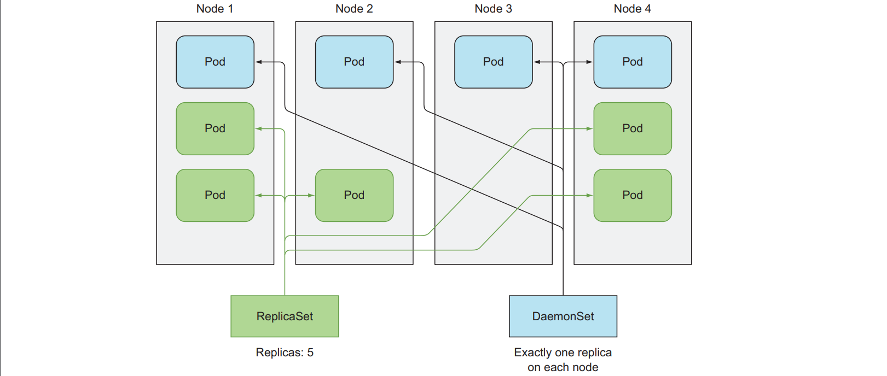
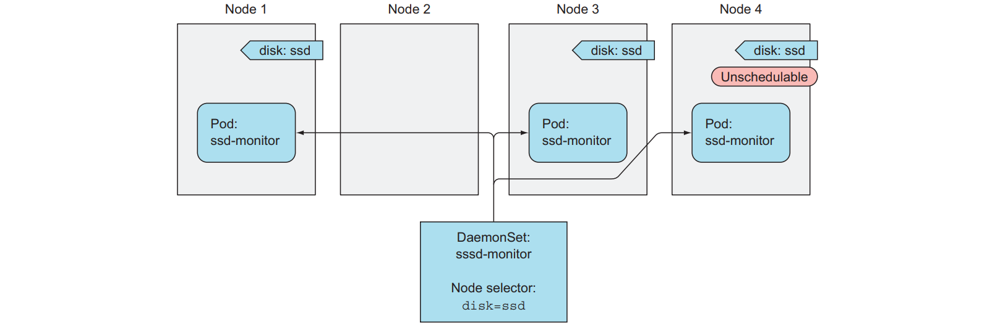
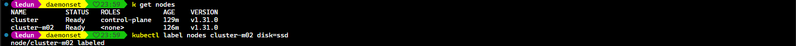
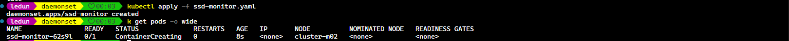
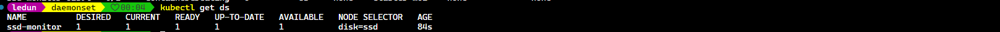
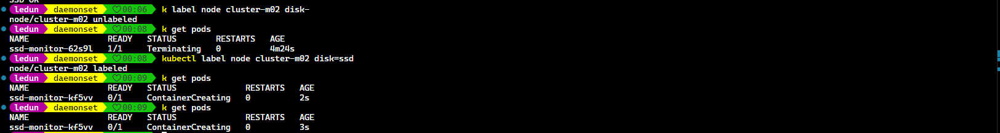

**Content:**

- The ReplicaSet is used to run a number of specifi pods on K8s cluster. But when you want to run a pod on every node, you can use DaemonSet.
- Some use cases: log collector, resource monitor on every node.
- Another good example is `kube-proxy` which needs to run on every node to make services network work.



- When a node is down, the DaemonSet will not launch a new pod on that node.
- When a new node is added to the cluster, the DaemonSet will launch a new pod on that node.
- When DaemonSet is deleted, it will recreate the pods using template configuration.

- By default, DaemonSet will run on all nodes, unless you specify `nodeSelector` to restrict it to only certain nodes.

**SSD Monitor DaemonSet**

- Let's say we have to monitor the health of SSD on every node that contains ssd. (labeled disk=ssd to all nodes that have SSD).





Docker file for the ssd monitor

```Dockerfile
FROM busybox
ENTRYPOINT while true; do echo 'SSD OK'; sleep 5; done
```





- I want to remove the label from cluster-m02 and see what will happen.
- Then I add the label back to cluster-m02 and see what will happen.
- As you can see when I removed the label from cluster-m02, the pod on node1 is deleted.
- When I added the label back to cluster-m02, the DaemonSet will launch a new pod on that node.



- To see the pod that DaemonSet created, you can use `kubectl get pods --selector=name=ssd-monitor`
- To see the pod's node, you can use `kubectl get pods -o wide`
- To see the pod's node, you can use `kubectl get pods -o wide`
