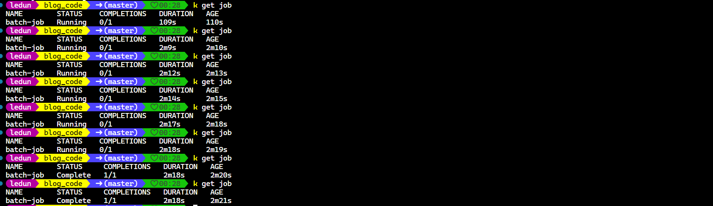
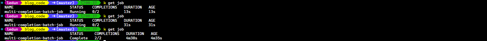
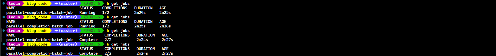

**Contents**

- [Problem](#problem)
- [Batch Job Image](#batch-job-image)
- [Multi-Completion Job](#multi-completion-job)
- [Parallel Completion Job](#parallel-completion-job)
- [Backoff Limit Job](#backoff-limit-job)

#### Problem

- You want to run a task on K8s cluster.
- You want to run a task only once.
- When it crashes, it will be restarted.
- When it finished, the pod will be removed.
- Job will help to resolve this issue.

#### Batch Job Image

```yaml
apiVersion: batch/v1
kind: Job
metadata:
  name: batch-job
spec:
  template:
    metadata:
      labels:
        app: batch-job
    spec:
      restartPolicy: OnFailure
      containers:
        - name: main
          image: luksa/batch-job
```

- Bactch job image

```Dockerfile
FROM busybox
ENTRYPOINT echo "$(date) Batch job starting"; sleep 120; echo "$(date) Finished succesfully"
```

- In the job we specify `restartPolicy: OnFailure`, so when the pod finished, it will be removed otherwise it will be restarted.


{}
The `restartPolicy` is by default `Always`, but the job should be finished, so we can either explicitly specify `restartPolicy: OnFailure` or `Never`.
{}

#### Multi-Completion Job

- Jobs may be configured to create more than one pod instance and run the in parallel or sequentially. This can be done through `completions` and `parallelism` properties in Job spec.

- Let's take a look at the example.

```yaml
apiVersion: batch/v1
kind: Job
metadata:
  name: multi-completion-batch-job
spec:
  completions: 2
  template:
    metadata:
      labels:
        app: batch-job
    spec:
      restartPolicy: OnFailure
      containers:
        - name: main
          image: luksa/batch-job
```

- The job will run twice in sequence
  

#### Parallel Completion Job

- To make the job run in parallel, we need to specify `parallelism` property.

```yaml
apiVersion: batch/v1
kind: Job
metadata:
  name: parallel-completion-batch-job
spec:
  completions: 2
  parallelism: 2
  template:
    metadata:
      labels:
        app: batch-job
    spec:
      restartPolicy: OnFailure
      containers:
        - name: main
          image: luksa/batch-job
```



{}
You can also change `parallelism` when the job is running by using command `kubectl scale job <job-name> --replicas=<new-parallelism>`
{}

#### Backoff Limit Job

- Another thing Job offer is limiting the wait time for pod to finish. This can help to avoid pod gets stuck. This can be done by setting `activeDeadlineSeconds` property in Job spec. You can limit number of retries via `spec.backoffLimit` field in Job spec.

```yaml
apiVersion: batch/v1
kind: Job
metadata:
  name: backoff-limit-batch-job
spec:
  backoffLimit: 2
  activeDeadlineSeconds: 100
  template:
    metadata:
      labels:
        app: batch-job
    spec:
      restartPolicy: OnFailure
      containers:
        - name: main
          image: luksa/batch-job
```
