**Contents**

[Why do we need to know this?](#why-do-we-need-to-know-this)

#### Why do we need to know this?

- Since in real-world application, we rarely have a single Pod to work alone. We usually have multiple Pods to work together by communcate through network.
- Because pod is ephemeral (can die and can be easily recreated ), this make the IP address of the Pod is not stable. Also we have multiple pods of the same application that are working concurrently (horizontal scaling). We need a mechanism that is stable for service to service communication

- To solve this problem, Kubernetes has a component called `Service` that is used to provide stable network access to the Pods.

#### Introduction to Service

- A resource to make a stable entry point
- Contains an IP address and port that never change
- Pods create connection to the Service's IP address and port, and the Service will redirect one of the Pods that are use Service

```shell
kubectl expose pod <pod-name> --port=<port-number> --name <service-name>
```

TODO: attach source code

**ClusterIP**

```yaml
apiVersion: v1
kind: Pod
metadata:
  name: app1
  labels:
    app: app1
spec:
  containers:
    - name: app1
      image: app1:svc
      imagePullPolicy: IfNotPresent
      env:
        - name: APP2_HOST
          value: app2-svc.default.svc.cluster.local
        - name: APP2_PORT
          value: "9999"
      ports:
        - containerPort: 8080
          protocol: TCP
      resources:
        limits:
          cpu: 1000m
          memory: 1Gi
        requests:
          cpu: 100m
          memory: 256Mi

---
apiVersion: v1
kind: Service
metadata:
  name: app1-svc
spec:
  selector:
    app: app1
  type: ClusterIP
  ports:
    - port: 8888
      targetPort: 8080
```

```yaml
apiVersion: v1
kind: Pod
metadata:
  name: app2
  labels:
    app: app2
spec:
  containers:
    - name: app2
      image: app2:svc
      imagePullPolicy: IfNotPresent
      ports:
        - containerPort: 8081
      resources:
        limits:
          cpu: 1000m
          memory: 1Gi
        requests:
          cpu: 100m
          memory: 256Mi

---
# https://kubernetes.io/docs/concepts/services-networking/service/
apiVersion: v1
kind: Service
metadata:
  name: app2-svc
spec:
  selector:
    app: app2
  type: ClusterIP
  ports:
    - port: 9999
      targetPort: 8081
```

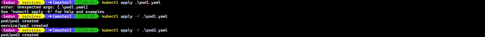

```shell
kubectl get pods
```

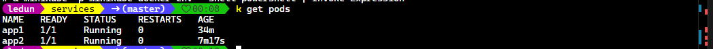

This project consists of a simple simple NodeJS deployed on Kubernetes. It includes two Node.js applications, app1 and app2, each running in its own pod and exposed via Kubernetes services. The primary goal of this setup is to demonstrate inter-service communication within a Kubernetes cluster.

- **Components**

- **app1**:
  - Functionality: Acts as a client that receives HTTP requests and forwards them to app2. It listens on port 8080 and, upon receiving a request, makes an HTTP GET request to app2 to fetch data.
  - Environment Variables: Uses APP2_HOST and APP2_PORT to determine the address and port of app2.
    **Service**: Exposed via a Kubernetes service app1-svc on port 8888, which forwards traffic to the pod's port 8080.
- **app2**:
  - Functionality: Acts as a server that responds to HTTP requests with a simple "Hello world" message. It listens on port 8081.
  - Service: Exposed via a Kubernetes service app2-svc on port 9999, which forwards traffic to the pod's port 8081.
    **Deployment**
  - Docker: Both applications are containerized using Docker. The Dockerfiles specify the Node.js environment and expose the necessary ports.
  - Kubernetes: The applications are deployed as pods in a Kubernetes cluster. Each application has a corresponding service to manage internal communication and expose the applications to other services within the cluster.
- **Usage**
- Port Forwarding: The kubectl port-forward command is used to forward traffic from the local machine to the app1 service, allowing external access to the application.
- This project serves as a foundational example of deploying and managing microservices in a Kubernetes environment, showcasing how services can communicate with each other using internal DNS and service discovery mechanisms.

* To use this project, we run all commands in sequence

```shell
# Build images from the current directory
docker build -t app1:svc -f app1/Dockerfile ./app1
docker build -t app2:svc -f app2/Dockerfile ./app2

# Deploy
kubectl apply -f pod1.yaml
kubectl apply -f pod2.yaml


# Forward port from service to local
kubectl port-forward svc/app1-svc 8888

```

- Then access to `http://localhost:8888/` we got the result like this.
  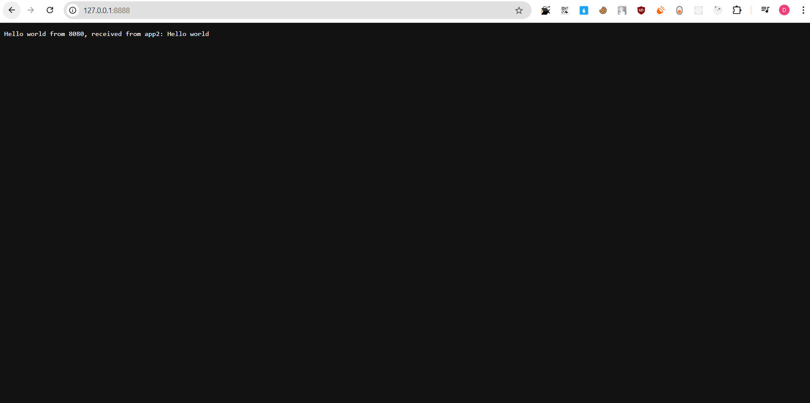

- You can also using kubectl exec command to test this out

```shell
kubectl exec app1 -- curl http://app1-svc.default.svc.cluster.local:8888
```


{}
Everything after -- is the command that we want to execute on the pod
{}

- In k8s cluster there is a `kube-dns` which acts as a global dns for entire cluster.
- Every pods in cluster have `/etc/resolv.conf` configure like the image bellow.

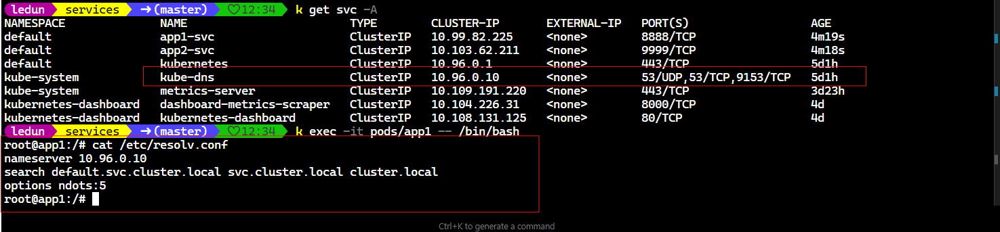

- There are some way that we can make use service name as DNS in cluster

```
- <service_name>.<namespace>.<svc>.<cluster>.<local>
- <service_name>.<namespace>.<svc>
- <service_name>.<namespace>
- <service_name>: if those service in the same namespace.
```

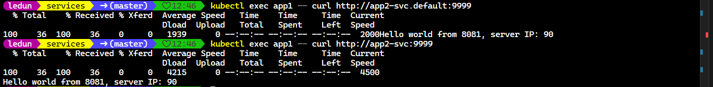

#### Connect to services living outside cluster

- A service have a component named `Endpoints` which is a list of IP address of the pods that the service will forward the traffic to.

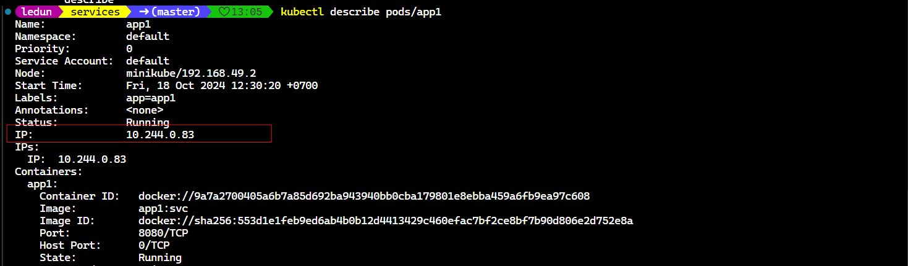

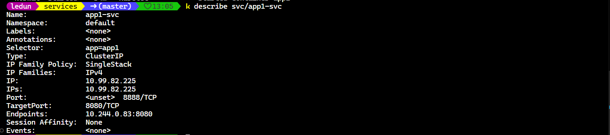

- The bellow command will list out all the endpoints of the service in the cluster.

```shell
k get endpoints
```

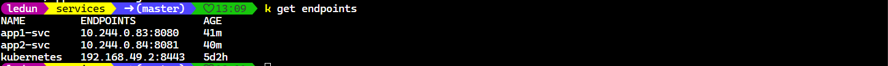

- A service endpoint can created manually to decouple from the service allow us to update manually.
- If the service without selector k8s will not create the endpoint for it.

**External Name**

```yaml
apiVersion: v1
kind: Service
metadata:
  name: external-name-svc
spec:
  type: ExternalName
  externalName: example.com
  ports:
    - port: 80

---
apiVersion: v1
kind: Service
metadata:
  name: external-ip-svc
spec:
  ports:
    - port: 80

---
apiVersion: v1
kind: Endpoints
metadata:
  name: external-ip-svc
subsets:
  - addresses:
      - ip: 93.184.215.14 # The ip get from the external service website you can use any ip of http you want
    ports:
      - port: 80
```

- By using this way you can temporary forward the traffic to the external service. When you decide to have implementation in the cluster you can change the selector to in the service so that it can forward the traffic to the new implementation.

{}
The service name and endpoint name must be the same.
{}

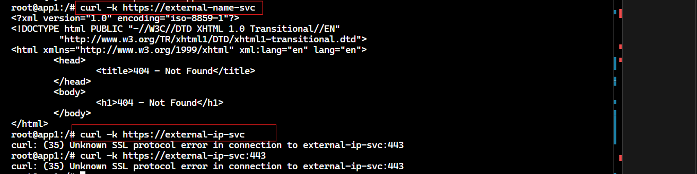

**Node Port**

```yaml
apiVersion: v1
kind: Service
metadata:
  name: node-port-svc
spec:
  type: NodePort
  selector:
    app: app1
  ports:
    - port: 80
      targetPort: 8080
      nodePort: 30008
```

- We can access to the service from the node by using the node ip and the node port.

```shell
curl http://<node-ip>:<node-port>
```

- For the cloud environment like AWS, GCP, Azure we need to make sure we allow the traffic from the internet to the `nodePort` because the `nodePort` is exposed to the internet.

- The `NodePort` service spans all the nodes so when we access to pod through one of the node ip, the request will be forwarded to one of the pods that the service that matched the selector.

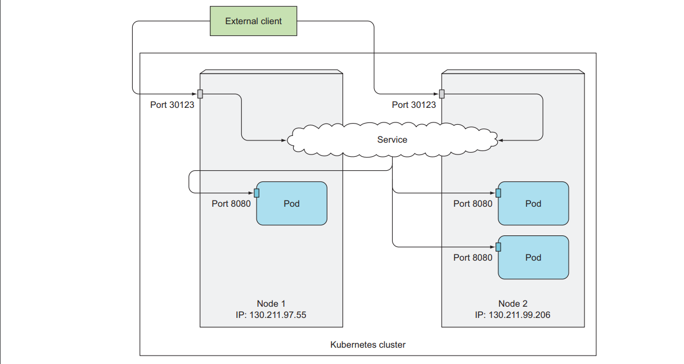

Up til now we have some way to expose service to be accessible from kubernetes cluster let recap those.

- `ClusterIP`: Expose the service on a cluster-internal IP.
- `NodePort`: Expose the service on each Node's IP at a static port. also allow internal access from the cluster. like `ClusterIP` does.
- `LoadBalancer`: Use the cloud provider's load balancer to expose the service externally. It is an enhanced version of `NodePort` that only forwared the traffic to healthy node that have the pod that the service need.
- `ExternalName`: Map the service to a DNS name.

{}
If using minikube don't support `LoadBalancer` type it will act as `NodePort` type.
{}

- It keeps pending since we are using minikube
  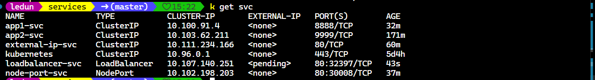

- The bellow image describe how the `LoadBalancer` type work.
  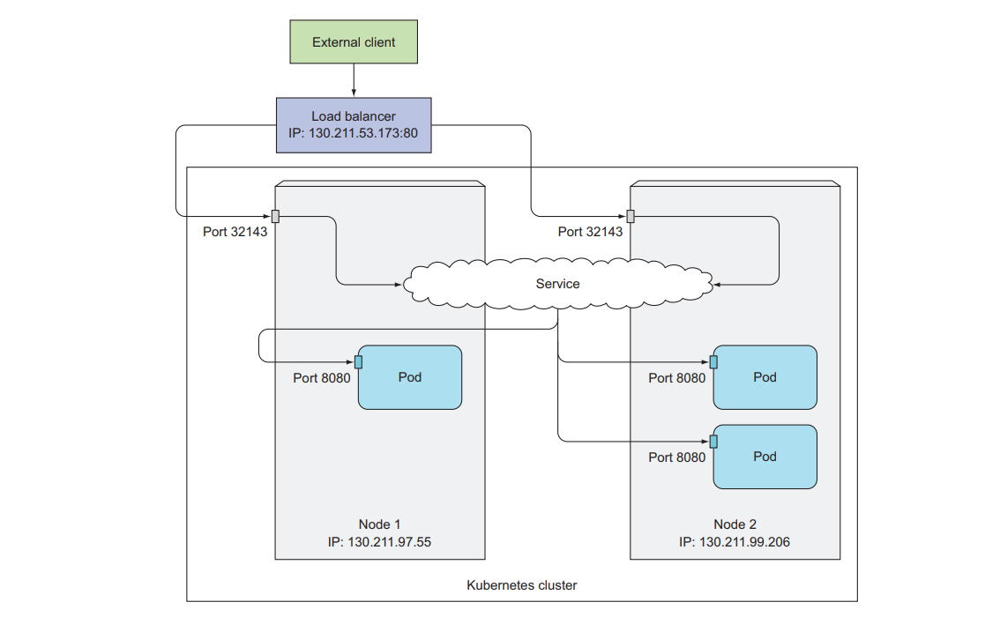

- Using LoadBalancer add 1 hop when a request is forwarded to the pod. To prevent this we can set `externalTrafficPolicy: Local` to make the request directly to the node that have the pod that the service need. But be careful with this option since if the node don't have the pod that the service need, the request will hang. So to make sure the number of node to achieve HA
- Using this approaching can lead to uneven distribution traffic to pods: for example if node A has 4 pods node B has 1 pod. Normally, the percentage of chance for pod to serve request is 20% for each pod. But using this approach that make each pod in node A have 12.5% while pod in node B has 50%
- Using this approach will loss the source IP address of the client who send the request to the service since this process using SNAT to change the source IP address to the node IP address.
  

#### Ingress

- Operate at layer 7 (HTTP) while the service operate at layer 4 (TCP)
- Ingress only require one load balancer and public IP while LoadBalancer need one loadbalancer and public ip for each service which waste the public ip address.
- Ingress allow to access dozens of services. When client send an HTTP request to ingress the host and path in the request determine which service the request should be forwarded to.

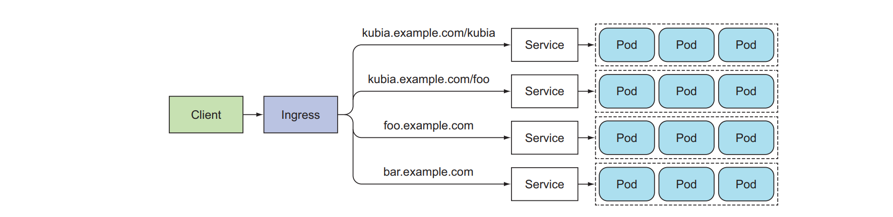

- It offer features such as sticky session of cookie.

**Ingress Controller**

- To use Ingress object we need to have an Ingress Controller in the cluster.
- Different k8s environment have different Ingress Controller implementation. Minikube didn't provide controller out of the box, but we can add an add-on that support Ingress so that we can play with Ingress.

```shell
minikube addons enable ingress
minikube addons enable ingress-dns

# Run two command in Administrator mode using powershell
```

- Add two lines to /etc/resolv.conf

First ssh to minikube

```shell
minikube ssh
```

- Edit /etc/resolv.conf

````shell
sudo echo -e "search test\nnameserver 192.168.58.2\ntimeout 5" >> /etc/resolv.conf

- Replace 192.168.58.2 with yours minikube ip

```shell
minikube ip
```


- In the ingress folder we run command to apply the ingress

```shell
kubectl apply -f sample.yaml
````

- Test if the ingress is working

```shell
curl http://hello-john.test
```

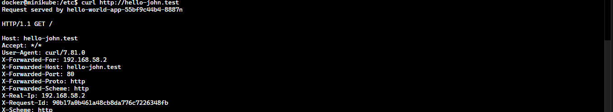

- Let's try to access to other path

```shell
curl http://hello-jane.test
```

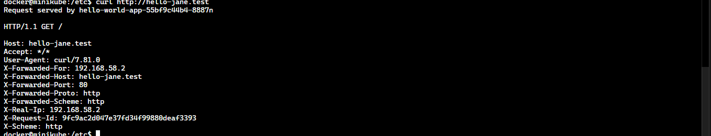


```yaml
apiVersion: networking.k8s.io/v1
kind: Ingress
metadata:
  name: app-ingress
spec:
  rules:
    - host: app.test
      http:
        paths:
          - path: /app1
            pathType: Prefix
            backend:
              service:
                name: app1-svc
                port:
                  number: 8888
    - host: app.test
      http:
        paths:
          - path: /app2
            pathType: Prefix
            backend:
              service:
                name: app2-svc
                port:
                  number: 9999

```
- We build ingress from app1 and app2 from Service module.
- Based on the path ingress will forward the request to the corresponding service.

#### Config Ingress to handle TLS traffic

**Create TLS certificate**

```shell
openssl genrsa -out tls.key 2048
openssl req -new -x509 -key tls.key -out tls.cert -days 360 -subj /CN=app.test
kubectl create secret tls tls-secret --cert=tls.cert --key=tls.key
```

- Update the ingress like this to use tls

```yaml
apiVersion: networking.k8s.io/v1
kind: Ingress
metadata:
  name: app-ingress
spec:
  tls:
    - hosts:
        - app.test
      secretName: tls-secret
  rules:
    - host: app.test
      http:
        paths:
          - path: /app1
            pathType: Prefix
            backend:
              service:
                name: app1-svc
                port:
                  number: 8888
    - host: app.test
      http:
        paths:
          - path: /app2
            pathType: Prefix
            backend:
              service:
                name: app2-svc
                port:
                  number: 9999
```
- Since the certificate is signed by our self so it is not trusted by the browser. We can use `curl` to test it

```shell
curl -k  https://app.test/app1
curl -k  https://app.test/app2
```

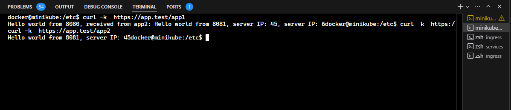

P 181