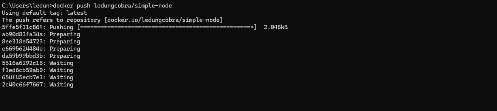

**Content:**

- [The need for a system like Kubernetes](#the-need-for-a-system-like-kubernetes)
- [Container technology](#container-technology)
- [The architecture of Kubernetes](#the-architecture-of-kubernetes)
- [Running application in Kubernetes](#running-application-in-kubernetes)

#### The need for a system like Kubernetes

Let's compare the features of **Monolithic Application** and **Microservices Application**

| Feature              | Monolithic Application                                                                                             | Microservices Application                                                                                                                           |
| -------------------- | ------------------------------------------------------------------------------------------------------------------ | --------------------------------------------------------------------------------------------------------------------------------------------------- |
| Architecture         | Single, tightly coupled unit. All components are interdependent and deployed as a single entity.                   | Collection of loosely coupled, independently deployable services. Services communicate with each other through well-defined APIs.                   |
| Development          | Initially simpler to develop and deploy.                                                                           | Can be more complex to develop initially. Requires careful API design and inter-service communication planning.                                     |
| Deployment           | Deployed as a single unit, simplifying initial deployment but making updates and rollouts more complex.            | Individual services can be deployed independently, allowing for more frequent updates and easier rollouts.                                          |
| Scalability          | Scaling often requires scaling the entire application, even if only specific components need additional resources. | Individual services can be scaled independently based on their specific resource requirements, leading to more efficient resource utilization.      |
| Maintenance          | Tight coupling between components makes modifications and updates risky, potentially impacting the whole system.   | Easier to maintain as changes to one service are less likely to affect others, enabling faster development cycles and reduced risk of errors.       |
| Technology Adoption  | Less flexible in adopting new technologies and frameworks. Changes may require updates throughout the application. | Greater flexibility to use different technologies for different services, allowing teams to choose the best tool for the job and foster innovation. |
| Resilience           | A failure in one component can bring down the entire application.                                                  | More resilient as a failure in one service is less likely to cascade and impact other services, leading to improved overall application stability.  |
| Monitoring/Debugging | Easier to monitor and debug as logs and metrics are centralized.                                                   | More challenging to monitor and debug in a distributed system. Requires tools and strategies for tracing requests across multiple services.         |

The Kubernetes system is designed to address the challenges and complexities of managing microservices applications.

- **Managing the Complexity of Microservices**: While microservices offer numerous advantages over monolithic architectures, they introduce complexities in terms of deployment, management, and inter-service communication. Kubernetes provides a platform that effectively addresses these challenges by automating many of the tasks involved in operating a distributed system.

- **Abstracting Away Infrastructure**: Kubernetes acts as an abstraction layer over the underlying infrastructure, allowing developers to deploy and manage applications without needing to be concerned about the specifics of the hardware or the operating system. This abstraction simplifies development and deployment, enabling greater focus on application logic rather than infrastructure concerns.

- **Automated Deployment and Scaling**: Kubernetes automates the deployment and scaling of applications, making it easy to roll out new versions and adjust the number of running instances based on demand or resource requirements. This automation reduces manual effort and allows applications to adapt dynamically to changing conditions

- **Self-Healing and Resilience**: Kubernetes continuously monitors the health of applications and automatically takes corrective actions, such as restarting failed containers or rescheduling them to healthy nodes. This self-healing capability ensures high availability and reduces the impact of failures, leading to more resilient applications.

- **Service Discovery and Load Balancing**: Kubernetes provides built-in mechanisms for service discovery and load balancing, enabling microservices to easily communicate with each other and distribute traffic efficiently. This functionality eliminates the need for developers to implement custom solutions for these tasks, simplifying development and improving application performance.

- **Declarative Management**: Kubernetes relies on a declarative approach to managing applications. Developers define the desired state of the system, and Kubernetes automatically takes the necessary steps to achieve and maintain that state. This approach simplifies configuration management and reduces the risk of errors compared to imperative approaches.

- **Improved Resource Utilization**: By automatically scheduling pods to nodes with available resources, Kubernetes optimizes resource utilization across the cluster. This efficiency can lead to significant cost savings, particularly in large-scale deployments or cloud environments.

- **Empowering Development Teams**: Kubernetes enables developers to deploy and manage their applications independently, without relying on operations teams for every task. This self-service capability streamlines development workflows and fosters greater collaboration between development and operations.

#### Container technology

- **What They Are**: The sources explain that containers are a lightweight approach to process isolation, achieving a similar outcome to virtual machines but with less overhead. Instead of running separate operating systems like VMs, containers use features of the Linux kernel, specifically Linux Namespaces and Control Groups (cgroups), to isolate processes and manage their resource usage'

- **Benefits over VMs**:
  - **Lower Overhead**: Containers are more lightweight than VMs because they share the host OS kernel and don't require booting a separate OS for each application. This efficiency allows a greater number of applications to run on the same hardware.
  - **Faster Startup**: Since containers don't involve booting a new OS, application startup is almost instantaneous.
  - **Portability**: Container images package the application and its dependencies, making them easily transferable and runnable on any machine with a compatible container runtime.
- **Platform**
  - **Docker**: is the most popular runtime, simplify build, distribute, run containerized applications.
  - **Rocket**: is alternative to Docker, it's good at security, adhere to open standard OCI format. It can also run Docker images.

In summary, Kubernetes leverages container technology to provide a robust platform for deploying, scaling, and managing containerized applications.

#### The architecture of Kubernetes

- It contains master node which host the Kubernetes Control Plane that controls and manage the whole Kubernetes system.
- Worker nodes are the machines that host the application containers.
- It's posible to run application on master node, but it's not recommended because it will affect the stability of the system.

  

##### **The Control Plane**

- Controls the cluster and make it function.

- **Components**:
  - **API Server**: Exposes the Kubernetes API that allows users to interact with the cluster.
  - **Scheduler**: Responsible for distributing work across the worker nodes.
  - **Controller Manager**: Enforces cluster policies and manages various aspects of the cluster state.
  - **etcd**: A consistent and highly-available key-value store used as Kubernetes' backing store for all cluster data.

The Control Plan hold and control the state of the cluster but they don't run you applications. This is done by the worker nodes.

##### **The Worker Nodes**

- The worker nodes are machines that run containerized applications.

**Components**:

- Docker, rkt or another container runtime which is responsible for running the containers.
- Kubelet: An agent that communicates with API Server and manage containers on its node.
- Kube-proxy: which load balances network traffic between between application components

#### Running application in Kubernetes

- To be able run application in Kubernetes, you need to package it into one or more container images then push it into image registry the post a description of your application to Kubernetes API server.

- After you submit the application description, the scheduler will schedule a group of containers (called pod) to run on the worker node on the available worker nodes based on compute and resource requirements. The Kubelet on those nodes then instructs the Container Runtime (Docker) to pull the container image from the registry and run it.


- Once the application is running, the Kubernetes API server will keep track of the running containers and their state. If you specify that you want to run 3 instances of your application, the Kubernetes will make sure that there are always 3 instances running. If one of the instances fails, the Kubernetes will restart it and make sure it is running again. Similarly, if the underlying machine running the container fails, the Kubernetes will reschedule the container to a healthy machine.

- While application is running, you can decide you want to increase or decrease the number of copies and Kubernetes will automatically spin sup additional ones or stop the extra ones, respectively. You can leave the jobs of deciding when to scale up or down to Kubernetes based on realtime metrics such as CPU and memory usage, queries per second or any other metric you app exposes.

- Pod are ephemeral, which means that if a pod goes down, Kubernetes will automatically restart it in another machine. To allow clients easily find the container that provide specific service, Kubernetes expose all of them at a single static IP address and expose that address to all application running in the cluster. But client can also use the DNS name of the service to find the IP address of the pod providing the service. The kube-proxy will make sure connection to the service are load balanced across all the containers that provide the service. The IP address of the service stays constant, so client can always connect to its containers, even when they're moved around the container.

**Benefits of using Kubernetes**:

- The OPS team doesn't need to deploy your application anymore.
- Because the containered application already contains all it needs to run, the system administrator doesn't need to install anything to deploy and run the app.
- On any node where Kubernetes is deployed, Kubernetes can run the app immediately without the help from sysadmins.
- Since Kubernetes exposes all its worker node as single deployment platform, application can be deploy on their own and don't need to know anything about the servers that make up the cluster.
- Without using K8s the sysadmin need to select one specific node that has an SSD and deploy the application there. But when using K8s, instead of selecting a specific node where your application should be run, it is more appropriate to tell K8s choosing node with SSD.
- Automatic scaling and self-healing capabilities. It means that the K8s will constantly monitor the running application and will restart it in another machine if it fails. If the K8s is running on cloud infrastructure, where adding additional nodes is easy and cheap, K8s can automatically add more instances of your application to handle increased load.

#### Running your first application in Kubernetes


The above diagram shows how a docker container is running on a single machine.

The following is the content of the `server.js` file that will be used as the application for this example:

```js
const http = require("http");
const os = require("os");
console.log("Kubia server starting...");
var handler = function (request, response) {
  console.log("Received request from " + request.connection.remoteAddress);
  response.writeHead(200);
  response.end("You've hit " + os.hostname() + "\n");
};
var www = http.createServer(handler);
www.listen(8080);
```

- The server logs the IP address of the client that made the request and send back the hostname of the machine it is running on.

`Dockerfile` to build the container image:

```dockerfile
FROM node:18
COPY server.js .
CMD ["node", "server.js"]
```

The source code can be download [here](files/simple-nodejs.zip).

- Build a container image:

```shell
docker build -t ledungcobra/simple-node .
```

You should replace `ledungcobra` with your Docker Hub username. This can help you to push image to your own repository on Docker Hub. If you need to push the docker image to ECR repository you should tag it with the ECR repository URL like this:

```shell
docker tag ledungcobra/simple-node:latest 123456789012.dkr.ecr.us-east-1.amazonaws.com/simple-node:latest
```


- To run the container image:

```shell
docker run -p 9000:8080 ledungcobra/simple-node
```

- `-p 9000:8080`: means that the container will be exposed on port 8080 and mapped to port 9000 on the host machine.


- To push image to Docker Hub:

```shell
docker push ledungcobra/simple-node
```

{}
Replace `ledungcobra` with your Docker Hub username.
{}


