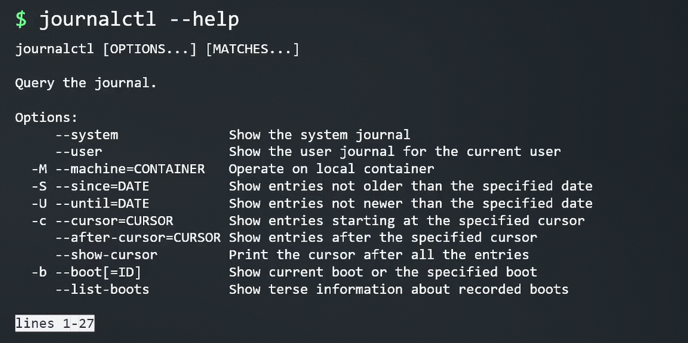
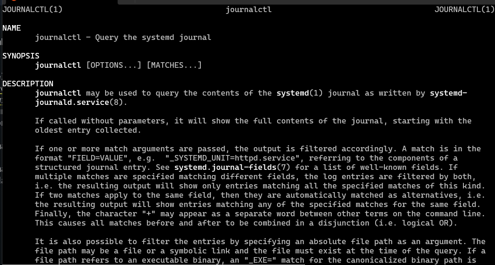
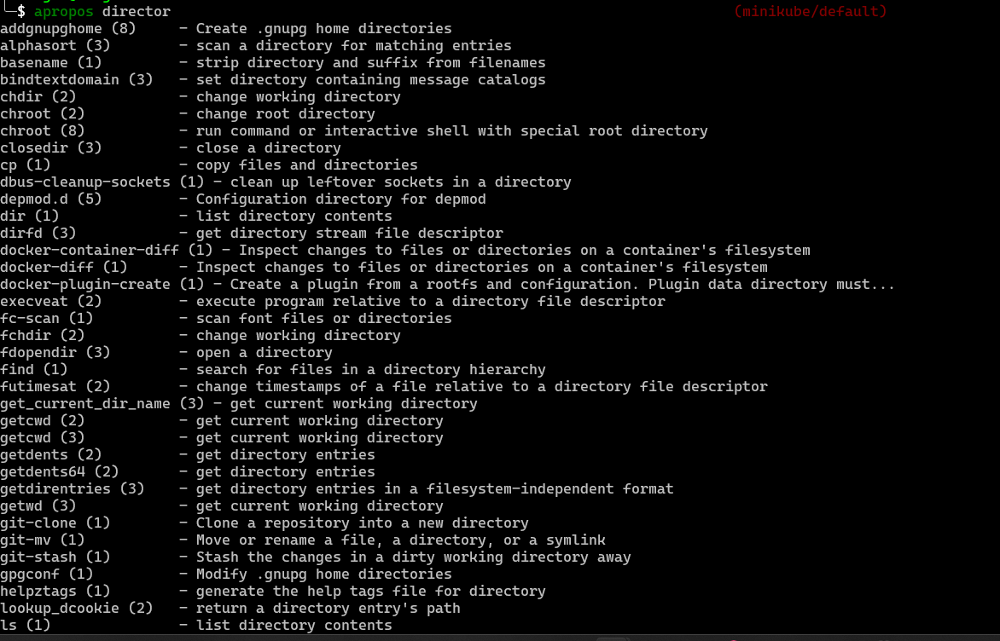

**Content:**

- [Read and use system documentations](#read-and-use-system-documentations)

# Read and use system documentations

```shell
command --help
```

* This will provide the documentation for the command.

But sometimes the document the  system give us is too long for example: `journalctl --help`

```shell
journalctl --help
```


* This will show us a `Pager` we need to scroll down to see the documentation by using either `Space`, `Enter`, `Arrow`.

* This will provide the documentation for the command.

* To access the shorter documentation ưe can use command

```shell
man journalctl
```



* Reading the man take time, so we can use `apropos` to search for the command.

```shell
apropos director
```



* Some time the database is not updated, so we can update the the database by running the command

```shell
sudo mandb
```
The apropos will result is more result that we can use, for example alphasort(3) is not the thing that we want, so we need to add -s for filter out 

```shell
apropos -s 1,8
```

* We can run partial command then press `tab` to trigger auto complete. Or press double tabs to see all the auto complete.

