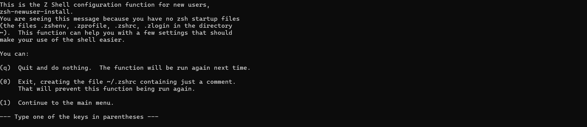

## Install Oh my zsh

- I will install oh my zsh in Centos 9 Linux here are command to install it

- Install zsh
```shell
sudo dnf install zsh
```

- Install yum-utils
```shell
sudo dnf install util-linux-user -y
```


- Set zsh as default shell
```shell
chsh -s /bin/zsh
```


- Then you need to input your password to change the default shell.

- To avoid this error, you need to install git first.


- Install git
```shell
sudo dnf install git -y
```


- Install oh my zsh use this link to get the command to install it [Oh my zsh](https://ohmyz.sh/#install)
```shell
sh -c "$(curl -fsSL https://raw.githubusercontent.com/ohmyzsh/ohmyzsh/master/tools/install.sh)"
```

- After install oh my zsh, you need to restart your terminal to see the change.
- After restart the terminal, you can see the dialog like this




- You need to press 0 to make it work then press enter. This will help you to create a .zshrc file in you home directory


- Boom!!! you have successfully install oh my zsh.

- The theme that commonly used is `agnoster` you can change it in your .zshrc file by running this command

```shell
nano ~/.zshrc
```

- Then change the theme to agnoster by adding this line `ZSH_THEME="agnoster"`

- Save the file and exit by pressing `Ctrl + X` then `Y` to save the file and `Enter` to exit the nano editor.

- Then restart your terminal to see the change.

- To see the change, you can run this command

```shell
omz reload
```


- Some common plugins that you can use are `zsh-autosuggestions` and `zsh-syntax-highlighting` you can install it by running this command

```shell
git clone https://github.com/zsh-users/zsh-autosuggestions ${ZSH_CUSTOM:-~/.oh-my-zsh/custom}/plugins/zsh-autosuggestions
git clone https://github.com/zsh-users/zsh-syntax-highlighting.git ${ZSH_CUSTOM:-~/.oh-my-zsh/custom}/plugins/zsh-syntax-highlighting
```
- Then you need to add the plugin to your `.zshrc` file by adding this line `plugins=(zsh-autosuggestions zsh-syntax-highlighting)`

- Save the file and exit by pressing `Ctrl + X` then `Y` to save the file and `Enter` to exit the nano editor.

- Then restart your terminal to see the change.

```shell
omz reload
```
- Then you can see the change like this
