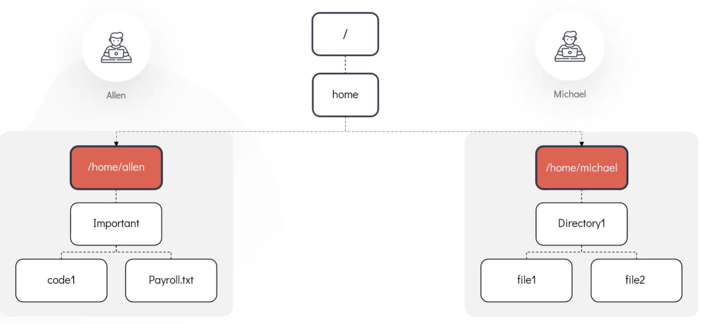
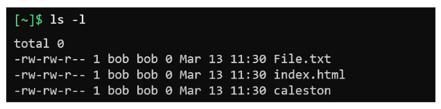
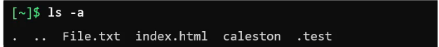
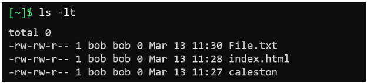
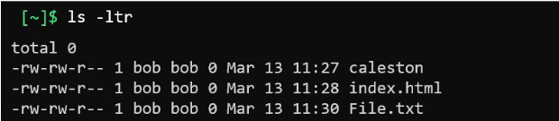
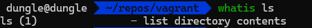
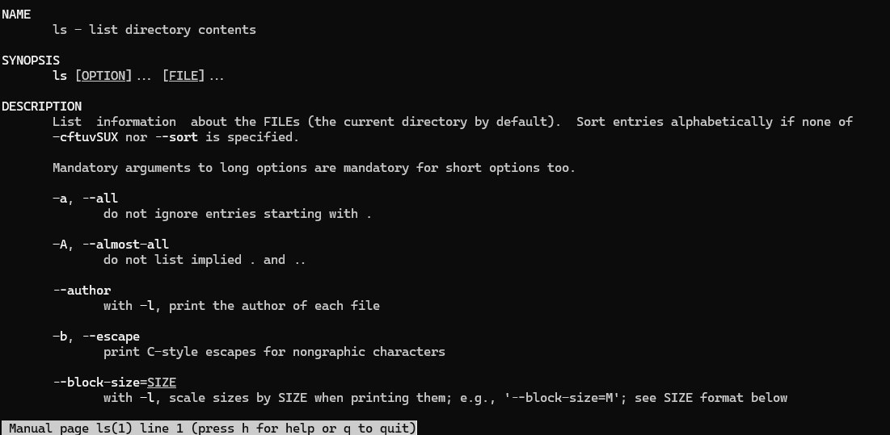
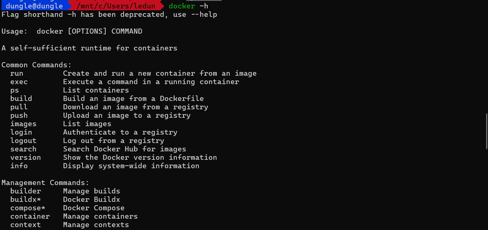
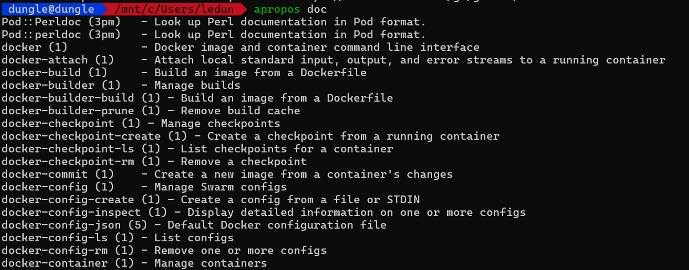

# Introduction to the Linux Shell

- This is a way to interact with the linux system, the shell provide more power than the graphical interface can. 
- When first load the shell, the shell usually point to `home directory`, by default each user in linux system have their own username which match exactly with the their home directory located at the path `~`. For example user `alen` has his home directory `/home/michael`, other user can't access your files

# Command in Linux
## Internal or built-in commands
- These commands are bundle by the shell itself.
- Common internal command including: 
  - `cd` (Change directory)
  - `export` to expose environment variables
  - `mkdir` (make directory)

## External commands
- These are binary program or scripts, which are usually located in distinct files in the system

- To determine whether command is internal or external , you can use the `type` command. For example: type echo

# Basic Linux commands
## Directory Navigation
- Show current working directory: run `pwd`
- Show contents in the directory: run `ls`
- There is a command `popd` that helps us navigate to the recently visited directory; it works like a stack mechanism.

## Directory Management
- To make a new directory, run `mkdir`. This command can create multiple directories by passing separated directory names.
- To create a directory with a specified path, you can run the command `mkdir -p /home/dungle/test-os`

## Moving and Renaming
- To move a directory from one place to another, you can use the `mv` command. There are two ways to use this command: by using a relative path or an absolute path.
  - Absolute path example: `mv /home/dungle/test-os /home/dungle/test-os-2/`
  - Relative path example: to move a directory named `test-os` from the current directory to a directory named `backup` within the current directory:
    - `mv test-os backup/test-os`
- To rename a file or directory, you can use the `mv` command.
  - `mv /home/dungle/test-os /home/dungle/test-os-2`

## Copying
- To copy a file or directory from one place to another, you can use the `cp` command.
  - `cp /home/dungle/test-os /home/dungle/test-os-2`
- To copy a directory with all its contents, you can use the `cp -r` command.
  - `cp -r /home/dungle/test-os /home/dungle/test-os-2`

## Deleting
- To remove a file or directory, you can use the `rm` command.
  - `rm /home/dungle/test-os`
- To remove a directory and all its contents, you can use the `rm -r` command.
  - `rm -r /home/dungle/test-os`

## Read file content
- To read file content, you can use the `cat` command.
  - `cat /home/dungle/test-os.txt`
- To add lines to file using `cat` command, you can use the `>` operator. The promt will wait for you to input the lines, when you are done, press `Ctrl + D` to save and exit.
  - `cat > /home/dungle/test-os.txt`
- To create an empty file, you can use the `touch` command.
  - `touch /home/dungle/test-os.txt`
- To display the first n lines of a file, you can use the `head` command. 
  - `head -n 10 /home/dungle/test-os.txt`
- To display the last n lines of a file, you can use the `tail` command.
  - `tail -n 10 /home/dungle/test-os.txt`
- To read file content and display it in a more readable format, you can use the `more` command. Use `Space` to scroll one screen at a time, `Enter` to scroll one line at a time `b` to scroll back one screen, `/` to search for a string in the file, `q` to exit.
  - `more /home/dungle/test-os.txt`

{}
The `more` command load entire file into memory, so it may not be efficient for large files.
{}

- Similar to `more` we have `less` command it is a more advanced version of `more` command. It does not load entire file into memory, instead it loads file in a page by page manner.
  - `less /home/dungle/test-os.txt`

- To list all files in a directory with more details, you can use the `ls -l

- To list all files in a directory including hidden files, you can use the `ls -a` command.

- To list all files in order modified time use command `ls -lt`

- To list all files in reverse order modified time use command `ls -ltr`

# Getting help

## Ask about function of command
- To ask about function of command, you can use the `whatis COMMAND_NAME` command.
  - `whatis ls`

## Getting full manual of command
- To get full manual of command, you can use the `man COMMAND_NAME` command.
  - `man ls`

## Getting help of command
- To get help of command, you can use the `COMMAND_NAME --help` command or `COMMAND_NAME -h` command.
  - `docker --help`
  - `docker -h`

## Searching for command
- To search for command, you can use the `apropos` command. This will search for the command that contains the keyword. In the example below, it will search for the command that contains the keyword `doc`.
  - `apropos doc`

