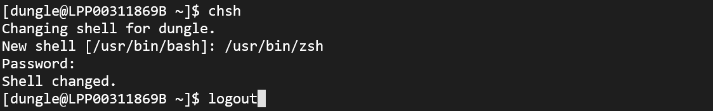
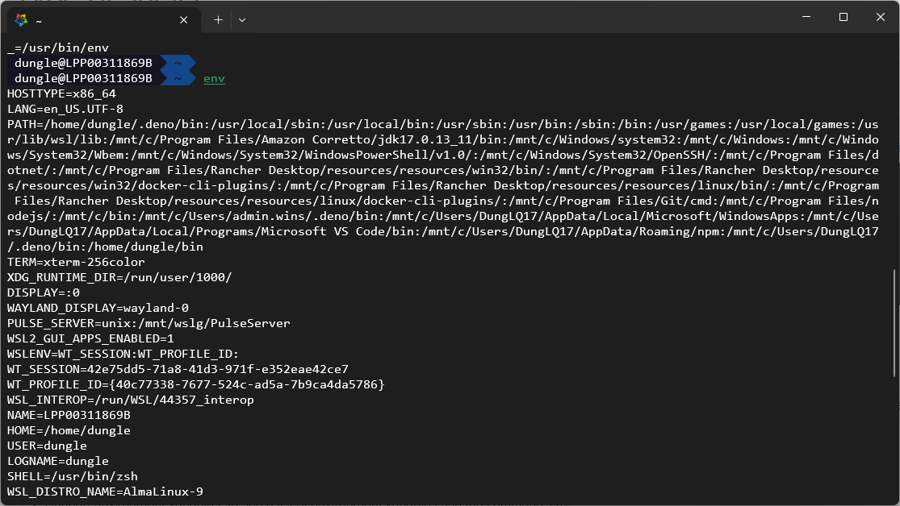
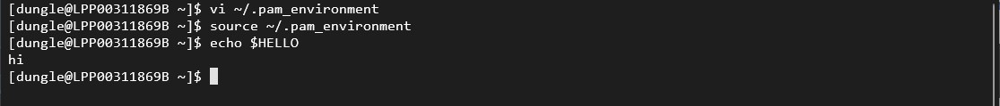
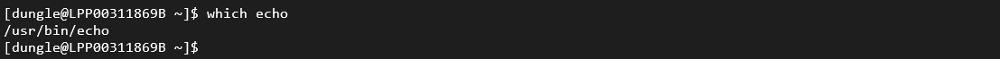
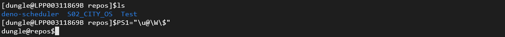

- [Type of shells](#type-of-shells)
- [Bash Shell Features](#bash-shell-features)

## Type of shells
- There're some shell that we can see in today: 
  - Bourne Shell(sh): Developed in 1970s for linux, still in use today.
  - Z Shell(zsh)
  - Bourne again Shell
- To check the shell currently in use use command `echo $SHELL`
- To change the default shell use command `chsh` the input the path of shell that you installed in your system, then `logout` and `login` the shell again to see the effect.

## Bash Shell Features
- The bash support auto-complete features that mean that you only need to type some character then press `tab` to complete the command or file name.
- Support to set custom alias for long command `alias hello="echo Hello world"`

- Support environment variables, to see a list of environment variables use the command `env`

- To set environment variable to can use command `export VARIABLE_NAME=value` but keep in mind that the variable will only be available in the current shell session. To make it permanent, you need to add it to your shell configuration file (e.g., `.bashrc`, `.bash_profile`, or `.profile`, `~/.pam_environment`) and then reload the configuration file by running `source ~/.bashrc` or `source ~/.bash_profile`. The following image is used to demonstrate how to change the PAM environment.

- When we're running `external command` the shell search for it in the `$PATH` variable for the existing of it and result in a failure if the command is not found in the directories specified in the `$PATH` variable.
- To check the location of a command can be identified by using `which echo` for example 

- When you're login to the shell it will show Prompt in the format like this `username@hostname`, but you can customize this by changing the `$PS1` environment variable the default of PS1 variable have format like this `[\u@\h \W]\$`. 
  - \u: current user
  - \h: hostname
  - \W: current working directory
  - \d: the date in format "Weekday Month Date" example: "Tue May 26"
  - \e: an ASCII escape character (033)
  - \H: the complete hostname
  - \n: new line
  - \r: carrigae return
  - \s: the name of the shell
  - \t: the current time in 24h format "HH:MM:SS"
  - \T: the current time in 12h format "hh:MM:SS"
  - \@: the current time in 12h am/pm format
  - \A: the current time in 24h format.
  - \w: the current directory with $HOME replaced by ~
  - \W: the basename of the current working directory with $HOME replaced by ~
- To change this we can update the `PS1` variable for example: `PS1="\u@\W\$"`
