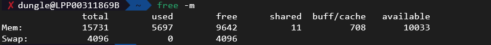
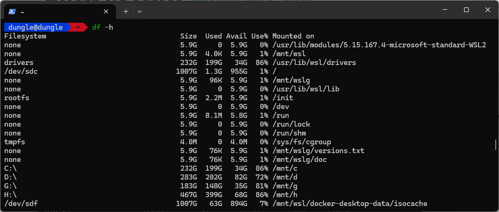

- [Linux kernel](#linux-kernel)
  - [Memory](#memory)
  - [Hardware](#hardware)
- [Boot Sequence of Linux](#boot-sequence-of-linux)
- [Boot level](#boot-level)
- [File types in linux](#file-types-in-linux)
- [File System Hierarchy](#file-system-hierarchy)

## Linux kernel
- It is the controller to manage the system resources for the whole linux.
- It manages for 
  - **Memory**: keep track of how much memory is use to store what and where.The kernel keeps track of memory usage, allocates and deallocates memory as needed, and ensures that different processes do not interfere with each other’s memory.
  - **Process**: determine which process can use the CPU, when and how long
  - **Device drivers**: These are specialized programs within the kernel that allow the operating system to communicate with hardware devices like printers, disks, and network cards.
  - **System call and security**: The kernel provides an interface for user applications to request services from the hardware (system calls) and enforces security policies to protect the system from malicious activities.
- To check the kernel currently in use, we can use command `uname -r`

- `dmesg` to display messages produce by the kernel during boot time and while the system is running.

### Memory
- The linux memory is separate into two parts:
  - Kernal Space (~ Kernal): process running in kernel space has unrestricted access to hardware. Examples of kernel space: Kernel code, kernel extensions, device drivers.
  - User Space (~User mode): process running in user space has limited access to hardware and is protected from directly accessing the hardware. Examples of user space: process writen in these programming languages: C, Java, Python, Ruby, Docker Containers.
- For example: the application written one of the above programming language when it need to access the hardware, it has to make a system call to the kernel which will then handle the request and provide the necessary access.

### Hardware
- `dsmeg` show event of devices since boot up.
- `lsblk` list block devices, the `disk` refer to physical disk, while `part` refer to the partition of the `disk`

- The `Major Number` identify the type of device
| Major Number | Device Type          |
| ------------ | -------------------- |
| 1            | Character Devices    |
| 3            | Hard disk or CD Room |
| 6            | Parallel printers    |
| 8            | SCSI disk            |

- `lscup`: show information of the CPU (threads, cores,...)

- `lsmem --summary` can be used to list the available memory in the system.

- `free -m` or `free -g` to check for available memory free in the system `-m`: to display in megabytes, `-g`: to display in gigabytes.

- `lshw` generate report to show information about the hardware

## Boot Sequence of Linux

- The **BIOS POST** have little to do with the Linux, POST stands for power-on self-test. In this phase the BIOS check the attached devices function correctly. 
- The next stage is boot loader, the bios execute code from the boot device located at the first sector of the disk, in linux it located at `/boot` file system. The boot loader can provide a menu to choose the kernel to boot or the kernel to boot directly.
- The next stage is kernel initialization, the kernel is the core of the linux operating system. It is responsible for managing the system resources such as initializing the hardware, managing the memory, and starting the system services.
- Once the kernel is initialized, it will start the init process, the init process is the first process to be executed when the system is booted. The `systemd` is responsible for mounting files system, starting and manage the other services. The is another thing that manage initialization process, it is called System V bu the systemd gain more popularity to check the `INIT process` supported in your system you can use command `ls -l /sbin/init`.

## Boot level
- The linux system can be booted in different level such as Graphic or Text mode.
- To check the current boot level, you can use command `runlevel` or `who -r`

| Runlevel | Description                        | Systemd Target    |
| -------- | ---------------------------------- | ----------------- |
| 0        | Halt/Shutdown                      | poweroff.target   |
| 1        | Single-user mode                   | rescue.target     |
| 2        | Multi-user mode without networking | multi-user.target |
| 3        | Boot in command line mode          | multi-user.target |
| 3        | Full multi-user mode               | multi-user.target |
| 4        | Unused/Custom                      | multi-user.target |
| 5        | Boot in graphical mode             | graphical.target  |
| 5        | Graphical mode                     | graphical.target  |
| 6        | Reboot                             | reboot.target     |
- To view systemd default target, you can use command `systemctl get-default`

- To change the boot level, you can use command `systemctl set-default SYSTEMD_TARGET` replace `SYSTEMD_TARGET` with the target on the table above.

## File types in linux
- There are 3 types of file in linux:
  - **Regular file**: a file that contains data, such as text, images, or other binary data.
  - **Directory**: a file that contains other files and directories.
  - **Special file**: 
    - `Character Files`: located under `/dev` directory allow the OS to communicate with the IO (mouse, keyboard) device serialy
    - `Block Files`: located under `/dev` directory allow the OS to communicate with the IO (hard disk, CD-ROM) device block by block
    - `Links`: this is a reference to another file, there are 2 types of links:
      - `Hard Link`: reference to the same file, the file and the link are different files, but they point to the same data. Delete one link will delete the data.
      - `Symbolic Link`: can be think as shortcut in windows, delete the symbolic link will not delete the data.
      - `Socket Files`: used for inter-process communication (IPC) between processes on the same machine.
      - `Named Pipe`: use for redirect data between processes. It work in unidirectional.
- To check the type of file, you can use command `file`

- Or can use the command `ls -l` to check the type of file

- The first letter `d` refer to directory.
| File Type        | Identify |
| ---------------- | -------- |
| Directory        | `d`      |
| Regular File     | `-`      |
| Character Device | `c`      |
| Block Device     | `b`      |
| Link             | `l`      |
| Socket           | `s`      |
| Pipe             | `p`      |
|                  |          |

## File System Hierarchy
- The file system hierarchy is the structure of the file system in linux.
  - **/bin**: contains binary files for user commands
  - **/boot**: contains the boot loader files
  - **/dev**: contains device files
  - **/etc**: contains configuration files for system services
  - **/home**: contains user's home directories
  - **/lib**: contains shared libraries
  - **/media**: contains mount points for removable media like USB drives, CDs, DVDs, etc.
  - **/mnt**: contains mount points for temporary filesystems
  - **/opt**: contains optional software packages
  - **/usr**: contains user programs and libraries
  - **/var**: contains variable data, such as log files, spool files, cached data and temporary files.
- To check the files mounted in system, you can use command `df -hP`

