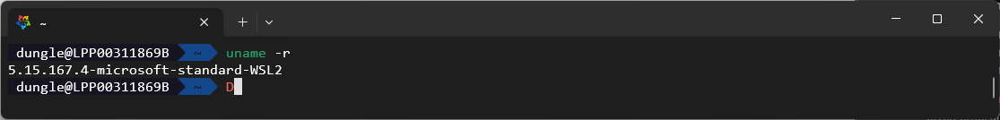
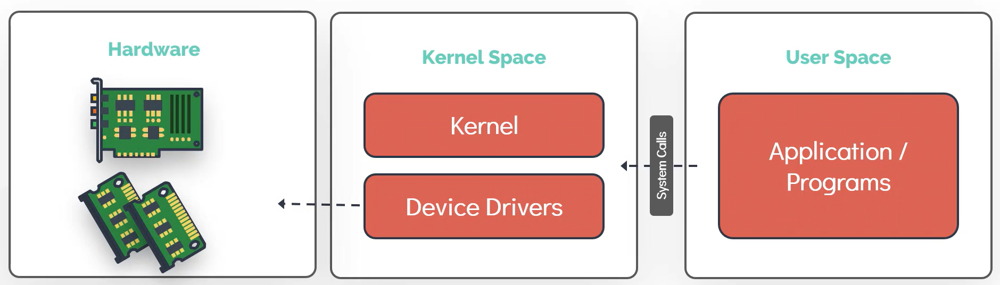
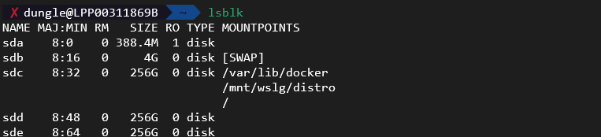
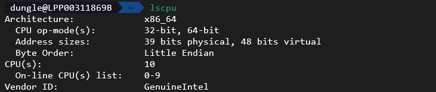
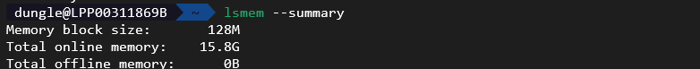
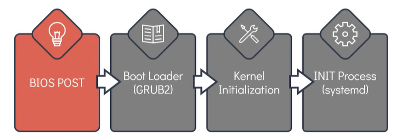

- [Linux core concepts](#linux-core-concepts)
  - [Linux kernel](#linux-kernel)
    - [Memory](#memory)
    - [Hardware](#hardware)
  - [Boot Sequence of Linux](#boot-sequence-of-linux)

# Linux core concepts

## Linux kernel
- It is the controller to manage the system resources for the whole linux.
- It manages for 
  - **Memory**: keep track of how much memory is use to store what and where.The kernel keeps track of memory usage, allocates and deallocates memory as needed, and ensures that different processes do not interfere with each other’s memory.
  - **Process**: determine which process can use the CPU, when and how long
  - **Device drivers**: These are specialized programs within the kernel that allow the operating system to communicate with hardware devices like printers, disks, and network cards.
  - **System call and security**: The kernel provides an interface for user applications to request services from the hardware (system calls) and enforces security policies to protect the system from malicious activities.
- To check the kernel currently in use, we can use command `uname -r`

- `dmesg` to display messages produce by the kernel during boot time and while the system is running.

### Memory
- The linux memory is separate into two parts:
  - Kernal Space (~ Kernal): process running in kernel space has unrestricted access to hardware. Examples of kernel space: Kernel code, kernel extensions, device drivers.
  - User Space (~User mode): process running in user space has limited access to hardware and is protected from directly accessing the hardware. Examples of user space: process writen in these programming languages: C, Java, Python, Ruby, Docker Containers.
- For example: the application written one of the above programming language when it need to access the hardware, it has to make a system call to the kernel which will then handle the request and provide the necessary access.

### Hardware
- `dsmeg` show event of devices since boot up.
- `lsblk` list block devices, the `disk` refer to physical disk, while `part` refer to the partition of the `disk`

- The `Major Number` identify the type of device
| Major Number | Device Type          |
| ------------ | -------------------- |
| 1            | Character Devices    |
| 3            | Hard disk or CD Room |
| 6            | Parallel printers    |
| 8            | SCSI disk            |

- `lscup`: show information of the CPU (threads, cores,...)

- `lsmem --summary` can be used to list the available memory in the system.

- `free -m` or `free -g` to check for available memory free in the system `-m`: to display in megabytes, `-g`: to display in gigabytes.

- `lshw` generate report to show information about the hardware

## Boot Sequence of Linux

- The **BIOS POST** have little to do with the Linux, POST stands for power-on self-test. In this phase the BIOS check the attached devices function correctly. 
- The next stage is boot loader, the bios execute code from the boot device located at the first sector of the disk, in linux it located at `/boot` file system