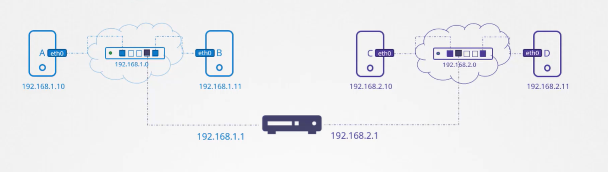

- [DNS](#dns)
  - [Search for domain](#search-for-domain)
  - [Tool to test DNS](#tool-to-test-dns)
- [Switching](#switching)
  - [Setup network computer 1](#setup-network-computer-1)
  - [Setup network computer 2](#setup-network-computer-2)
- [Routing](#routing)
  - [Setup a linux host as Router](#setup-a-linux-host-as-router)
  - [Note](#note)


## DNS
* Allow you to connect to other host by using DNS name instead of IP address.
* Instead of each time we have new server we need to add ip address to `/etc/hosts` file all we need to do is to host a `DNS server` that maintains a list
of DNS record.
* The client need to configure `/etc/resolv.conf`
```
nameserver DNS_SERVER_IP
```
* If you have duplicated DNS name in `/etc/hosts` and DNS server the order is determined by the file `/etc/nsswitch.conf`


* Files stand for the  `/etc/hosts`, dns stands for DNS server.

### Search for domain
* /etc/resolv.conf
```
nameserver 1.1.1.1
search mycompany.com
```
### Tool to test DNS
* `nslookup`
Example result should look like this:
```
Server:         1.1.1.1
Address:        1.1.1.1#53

Non-authoritative answer:
Name:   mycompany.com
Address: 192.168.1.1
```
* `dig`
Example result should look like this:
```
; <<>> DiG 9.11.3-P4-RedHat-9.11.3-26.P4.el8_8.1 <<>> mycompany.com
;; global options: +cmd
;; Got answer:
;; ->>HEADER<<- opcode: QUERY, status: NOERROR, id: 1000
;; flags: qr rd ra; QUERY: 1, ANSWER: 1, AUTHORITY: 0, ADDITIONAL: 1

;; ANSWER SECTION:
mycompany.com. 0 IN A 192.168.1.1
```

## Switching
* This creates a network for systems to connect with each other.


### Setup network computer 1
* Get network interface 
```shell
ip link
```

* Add address to VIF
```shell
ip addr add 192.168.1.10/24 dev eth0
```

### Setup network computer 2
* Get network interface 
```shell
ip link
```

* Add address to VIF
```shell
ip addr add 192.168.1.11/24 dev eth0
```

* Now we can run ping command to test connectivity from computer 1
```shell
ping 192.168.1.11
```

## Routing
* To allow computers in different networks to communicate with each other we can use `Router`



* To checking the list of routes available in the computer run the below command
```shell
route
```
* The system A (left) and the system B(right). If the system B want to talk with system A it need to configure route

```shell
ip route add 192.168.2.0/24 via 192.168.1.1
```
* The command allows the system B to access the System A via the Gateway at `192.168.1.1`

* To allow route traffic to internet use command
```shell
ip route add default via 192.168.2.1
```


### Setup a linux host as Router

* We have the computer B sit between computer A and C, we need to make computer A and computer C can talk to each other.
* From the computer A it can configure to send traffic to CIDR block `192.168.2.0/24` through Gateway `192.168.1.6`
```shell
ip route add 192.168.2.0/24 via 192.168.1.6
```

* The same config can apply in computer C so that it can send traffic to CIDR block `192.168.1.0/24` thorugh Gateway `192.168.2.6`
```shell
ip route add 192.168.1.0/24 via 192.168.2.6
```

* But this setting still is not enough for Computer A `ping` to computer B vice versa. We need explicit allow forward traffic in computer B
* We can allow it by running the below command
```shell
sudo sh -c "echo 1 > /proc/sys/net/ipv4/ip_forward"
```

* But the setting will be lost when we restart the system, to make this work well we need to update in the `/etc/sysctl.conf` file.

```
/etc/sysctl.conf
...
net.ipv4.ip_forward = 1
...
```


### Note 

```shell
ip link # show interfaces
ip addr # show addresses of interfaces
ip addr add 192.168.1.10/24 dev eth0 # Set ip for network inteface
```
Note that the changes are not persist after reboot.
