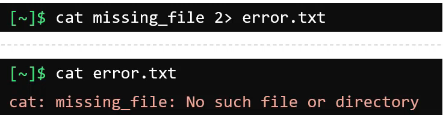
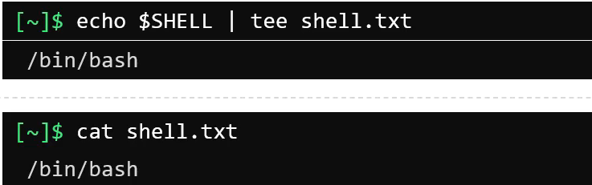

## File compression and archiving
- To view size of file use command: `du -sh <file_name>` or we can use `ls -lh <file_name>` to view the size of file.

- To archive a file use command: `tar -cvf <archive_name>.tar <file_name1> <file_name2> <file_name3> ...`, the -c option is used to create a new archive, -v is used to show the progress of the archive process, -f is used to specify the name of the archive file.

- To see content of the archive file use command: `tar -tf <archive_name>.tar`, the -t option is used to list the contents of the archive file.
- To extract the content of the use command: `tar -xvf <archive_name>.tar`, the -x option is used to extract the archive, -v is used to show the progress of the extraction process, -f is used to specify the name of the archive file.
- To compress the `tar ball` use command: `tar -zcvf <archive_name>.tar.gz <file_name1> <file_name2> <file_name3> ...`, the -z option is used to compress the archive file.

### Compressing
- There are some tool in linux to compress file:
  - bzip2: `bzip2 <file_name>`
  - gzip: `gzip <file_name>`
  - xz: `xz <file_name>`

### Decompressing
- There are some tool in linux to decompress file:
  - bzip2: `bunzip2 <file_name>`
  - gzip: `gunzip <file_name>`
  - xz: `unxz <file_name>`

## Searching Files and Directories
- To search for files and directory you can use command: `locate <file_name>`, this command will search for the file in database named `mlocate.db`. If you're just install the Linux or the file you created recently, you need to update the database by using command: `updatedb`(need root permission).
- Another way is to use command: `find <path> -name <file_name>`, this command will search for the file in the specified path.

## Filter text
- `grep` is a common commands to filter text.

**Commands**
- To search for the line that contain the word `hello` in the file `test.txt` use command: `grep "hello" test.txt`.
- The above command is case sensitive, if you want to search for the line that contain the word `hello` in the file `test.txt` use command: `grep -i "hello" test.txt`.
- To search for the content recursively in the directory use command: `grep -r "hello" <directory_name>`.
- To search for lines that don't match the pattern use command: `grep -v "hello" test.txt`.
- To match the whole word use command: `grep -w "hello" test.txt`.

- To show how many lines before the matching pattern use command: `grep -B <number_of_lines> "search_pattern" file_name`.

- To show how many lines after the matching pattern use command: `grep -A <number_of_lines> "search_pattern" file_name`.

- We can combine `-A` and `-B` to show how many lines before and after the matching pattern use command: `grep -A<number_of_lines> -B<number_of_lines> "search_pattern" file_name`.

## I/O Redirection

**Standard Streams in Linux**
- Standard Input (stdin): accept text as input
- Standard Output (stdout): output text
- Standard Error (stderr): output error text

**Commands**
- To forward the output to a file use the symbol `>`, example: `echo $SHELL > shell.txt`. This command will forward and replace the content of the file `shell.txt`.

- To forward the output to a file and append the content of the file use the symbol `>>`, example: `echo $SHELL >> shell.txt`. This command will forward and append the content of the file `shell.txt`.

- To forward the error output to a file use the symbol `2>`, example `cat missing_file 2> error.txt`. This command will forward the error output to the file `error.txt`. If the file `error.txt` is not exist, it will be created. Otherwise, it will be overwritten.

- But if you don't want to overwrite the file, you can use the symbol `2>>`, example `cat missing_file 2>> error.txt`. This command will forward the error output to the file `error.txt` and append the content of the file `error.txt`.

- If you want command to run but don't want it shows error on the screen you can use command `cat missing_file 2>/dev/null`. The `/dev/null` is a special file that discard the output.

## Command line pipes
- This links the output of one command to the input of another command.
- The syntax is `command1 | command2 | command3 | ... | commandN`.
- Another way to work with Standard Streams is to use `tee` command. The `tee` command is used to write the output to a file and also display it on the screen.
- The syntax is `command | tee <file_name>`.

- To append the output to a file when using `tee` command we should use option `-a`, example `command | tee -a <file_name>`.

