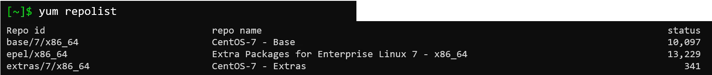
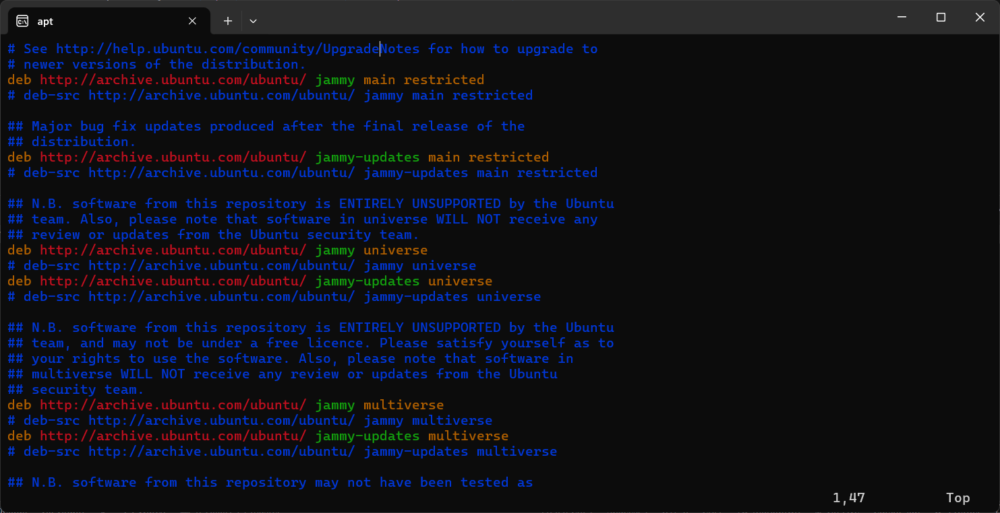
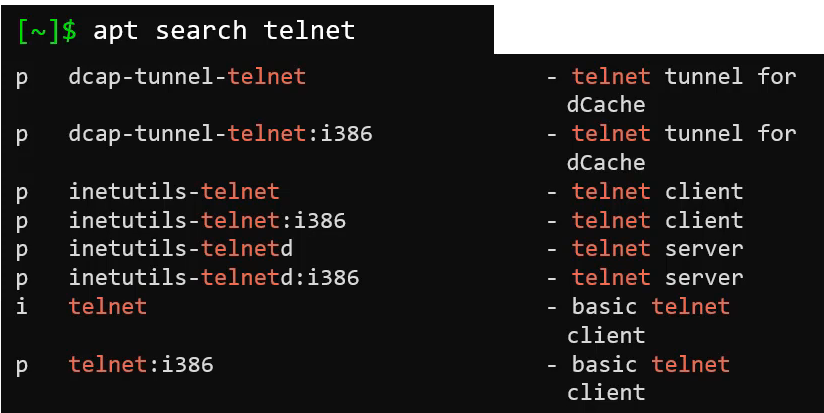
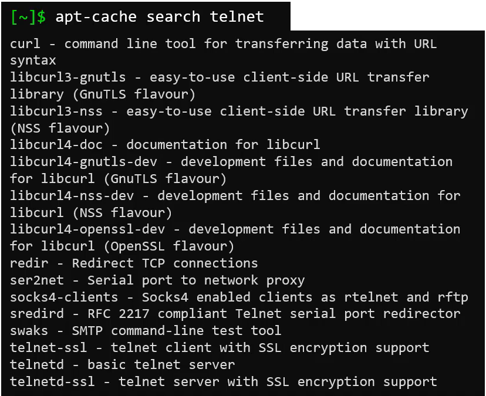

## Introduction
- In this article, we will focus on two types of package manager:
  - RPM-based: Red Hat Package Manager
    - This include: RHEL, Centos, Fedora, etc.
  - DEB-based: Debian Package Manager
    - This include: Ubuntu, Debian, Linux Mint, etc.

**What is package?**
- This is a compress archive file that contains the software that we want to install.
- The package contains only the binary file and the metadata of the software without its dependencies. This makes the installation more tedious since we need to install the dependencies manually.
- That's why the package manager comes to help us to resolve this issue.

## Types of package managers
- dpkg: Debian Package Manager
- apt: new generation of dpkg
- apt-get: old generation of apt
- rpm: Red Hat Package Manager
- yum: frontend of rpm
- dnf: new generation of yum

## Working with RPM
- Some operation of rpm:
  - Installing a package: `rpm -ivh <package_name>` i stands for install, v stands for verbose, h stands for hash
  - Uninstall a package: `rpm -e <package_name>` e stands for erase
  - Upgrading a package: `rpm -Uvh <package_name>` U stands for upgrade
  - Querying a package: `rpm -q <package_name>` q stands for query
  - Verifying a package: `rpm -Vf <package_name>` V stands for verify, f stands for file
- The installed rpm packages are stored in `/var/lib/rpm` directory. It's used for query the installed packages.

**Talk about YUM package manager**
- YUM stands for Yellowdog Updater, Modified. It's free and open source software. It works on RPM-based systems.
- YUM used repositories to store information about the packages. The repositories are stored in `/etc/yum.repos.d` directory and the repository file is named `*.repo`.
- To show a list of repositories, we can use `yum repolist` command.

- If you want to check which package provide command to work you can use command `yum provides <command_name>`.

- It says that we should install `openssh-clients-7.4p1-21.el7.x86_64` for `ssh` command to work.
- To install the package, we can use `yum install <package_name>` command.
- To remove package, we can use `yum remove <package_name>` command.
- To update package, we can use `yum update <package_name>` command.
- To update all packages, we can use `yum update` command.

## Working with Debian based package manager
- dpkg is a low-level package manager for Debian-based systems.

**Features of dpkg?**
- Install a package: `dpkg -i <package_file_name>`
- List installed packages: `dpkg -l <package_name>`
- Uninstall a package: `dpkg -r <package_file_name>`
- Check status of a package: `dpkg -s <package_name>` check if the package is installed
- Query a package: `dpkg -l <package_name>`
- Verify a package: `dpkg -p <package_name>`: show the package number, maintainer,...
- Just like `rpm` the `dpkg` sometimes failed due to dependencies issue. To resolve this issue, the `apt` and `apt-get` are created.
- The repository for `apt` is defined in `/etc/apt/sources.list` file.

**Some common commands of apt**
- Update the package list: `apt update` this command will download the package list from the repository and store it in `/var/lib/apt/lists` directory.
- Upgrade the package: `apt upgrade` this command will upgrade the installed packages to the latest version.
- Update repository: `apt edit-sources` this command will edit the repository file.

- To install a package: `apt install <package_name>`
- To remove a package: `apt remove <package_name>`
- To search package: `apt search <package_name>`
- To list all available packages: `apt list` this command will list all available packages in the repositories.

**Why apt is better than apt-get?**
- Install application by using `apt` show the output of the installation process like enough information to know the installation is successful, progress bar, etc compared to `apt-get`.
- You an search for package by using `apt search <package_name>` while `apt-get` doesn't support this feature, you have to use `apt-cache search <package_name>` to do this but it show alot of information that you don't need.

| apt telnet                  | apt-cache search telnet         |
| --------------------------- | ------------------------------- |
|  |  |

