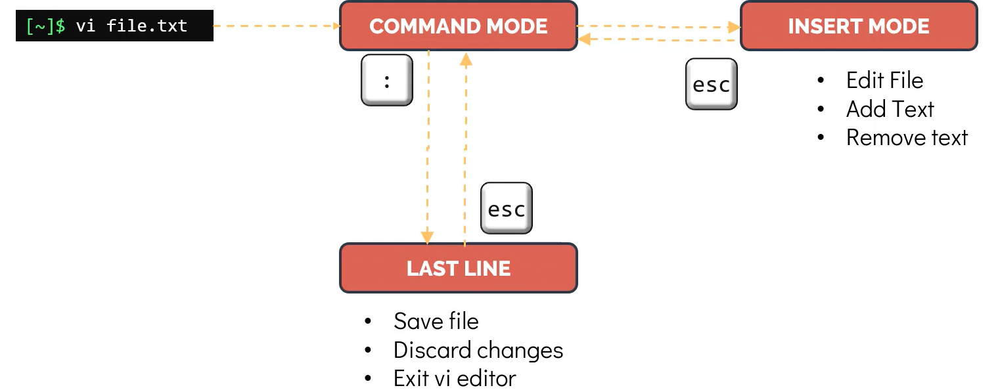

- [Introduction](#introduction)
- [Command Mode](#command-mode)
- [Insert Mode](#insert-mode)
- [Last Line Mode](#last-line-mode)
- [VIM](#vim)

## Introduction
- VI is a text editor that is included in the most Linux operating system.
- The VI editor contains about three modes:
  - **Command mode**: This is the default mode when you open the VI editor. In this mode, you can move the cursor, delete, copy, and paste text.
  - **Insert mode**: This mode is used to insert text. To enter this mode, you can press `i` key.
  - **Visual mode**: This mode is used to select text. To enter this mode, you can press `v` key.
  - **Last line mode**: This mode is used to run commands. To enter this mode, you can press `:` key.

## Command Mode
- In this mode, you can move the cursor, delete, copy, and paste text.
- To enter this mode, you can press `ESC` key.
- To move the cursor, you can use the following keys:
  - `h`: Move the cursor to the left.
  - `j`: Move the cursor down.
  - `k`: Move the cursor up.
  - `l`: Move the cursor to the right.
  - `up`: Move the cursor up.
  - `down`: Move the cursor down.
  - `left`: Move the cursor left.
  - `right`: Move the cursor right.
  - `home`: Move the cursor to the beginning of the line.
  - `end`: Move the cursor to the end of the line.
  - `page up`: Move the cursor up one page.
  - `page down`: Move the cursor down one page.

- Common commands: 
  - `yy`: Copy the current line.
  - `p`: Paste the copied text.
  - `dd`: Delete the current line.
  - `u`: Undo the last command.
  - `ctrl + r`: Redo the last command.
  - `u`: Undo the last command.
  - `ctrl + u`: Undo the last command.
  - `ctrl + w`: Delete the word under the cursor.
  - `ctrl + k`: Delete the line under the cursor.
  - `x`: to delete a letter under the cursor.
  - `d3d`: delete 3 lines. the number 3 can be replaced with any number.
  - `/pattern_to_search`, `?pattern_to_search`: to search for a pattern in the file. It will search from the current cursor position downwards.
  - `n`: Find next in the search pattern.
  - `N`: Find previous in the search pattern.
  - `G`: Move the cursor to the end of the file.
  - `gg`: Move the cursor to the beginning of the file.
  - `A`: Move the cursor to the end of the line.

## Insert Mode
- It is used to insert or write data to file.
- `i`, `o`, `a`: are used to enter this mode.
- `esc`: to exit this mode.

## Last Line Mode
- It is used to run commands.
- `:`: to enter this mode.
**Some common commands**
- `w`: to save the file.
- `q`: to exit the VI editor.
- `q!`: to exit the VI editor without saving.
- `wq`: to save and exit the VI editor.
- `wq!`: to save and exit the VI editor without asking for confirmation.
- `set nu`: to show the line number.
- `set nonu`: to hide the line number.

## VIM
- VIM is the upgraded version of VI.
- All of command in VI is also available in VIM.
- VIM also supports completion, plugins, spell check, syntax highlighting, gui, etc.
- In some linux distribution vi is replaced by vim.
- To check default editor in your system use command `update-alternatives --display editor`.
