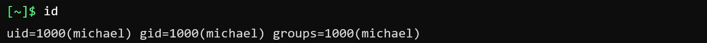

- [Access Control](#access-control)
- [Managing Users](#managing-users)
- [File Permission](#file-permission)
- [SSH and SCP](#ssh-and-scp)
  - [SSH](#ssh)
  - [SCP](#scp)
- [Network Security](#network-security)
- [Cron Jobs](#cron-jobs)


## Access Control
- Before diving into access control, we need to understand the concept of account in Linux.
- Every user in linux has an account, it may associate with username and password to login to the system, user account is associate with and unique identifier called `UID`.
- The information about user account is stored in `/etc/passwd` file.

- The group is to group users into common in role and permission.
- The information about group is stored in `/etc/group` file. Each group has a unique identifier called `GID`.

- `The super user` is a user with UID 0, it has all the permission to the system named `root`.
- `The system accounts` are user with UID < 100 OR between 500 - 1000 created while installing the system. They don't have a home directory.
- `The service accounts` are similar to system account, but they created while service is installed.
- `The normal account` is user with UID > 1000, they are created by system administrator to run the system service.
- `id`: to check the user information.

- `who`: to check the current user information.

- `last`: to check the last login information.

-`su -`: swich to root user.
- `sudo <command>`: to run the command with root permission. The config for sudo is in `/etc/sudoers` file. Only user listed in sudoers file can use sudo.

- Let's discuss about the sudoers file
| Field | Description                  | Example                    |
| ----- | ---------------------------- | -------------------------- |
| 1     | User or group                | bob,%sudo(group)           |
| 2     | Host                         | localhost, ALL(default)    |
| 3     | User                         | ALL (default)              |
| 4     | Command user or group can do | /bin/ls, ALL(unrestricted) |

- To prevent user from login to the system as root user, we can disable it by edit the `/etc/passwd` file.
```shell
/root:x:0:0:root:/root/usrc/sbin/nologin
```
- Most of access control files are stored in `/etc/` directory. This directory is read by any people by default, but only root can write to it. These access control files are designed in a way that we should not edit them using text editor, instead we should use built-in command to edit them.
- The password file is stored in `/etc/shadow` file, passwords are hashed 
**Let's see the structure of the /etc/passwd file**
```
USERNANE:PASSWORD:UID:GID:GECOS:HOMEDIR:SHELL
```
- `USERNANE`: the username of the user.
- `PASSWORD`: the hashed password of the user.
- `UID`: the unique identifier of the user.
- `GID`: the unique identifier of the group.
- `GECOS`: CSV format of the user information such as full name, office phone number, home phone number, etc.
- `HOMEDIR`: the home directory of the user.
- `SHELL`: the shell of the user.

**Let's dissect the /etc/shadow file**
```
USERNAME:PASSWORD:LASTCHANGE:MIN_AGE,MAX_AGE:WARN:INACTIVE:EXPDATE
```
- `USERNAME`: the username of the user.
- `PASSWORD`: the hashed password of the user. Empty mean the password is not set.
- `LASTCHANGE`: the last time the password was changed.
- `MIN_AGE`: the minimum age the user can change the password.
- `MAX_AGE`: the maximum age the user have to change the password.
- `WARN`: the number of days before the password expires that the user will be warned.
- `INACTIVE`: the number of days after the password has expired that the account still can be used before it is locked. Empty mean it is not enforced.
- `EXPDATE`: The date when the password expires. Empty mean it is not enforced.

**Let's dissect the /etc/group file**
```
NAME:PASSWORD:GID:MEMBERS
```
- `NAME`: the name of the group.
- `PASSWORD`: the hashed password of the group. Empty mean the password is not set.
- `GID`: the unique identifier of the group.
- `MEMBERS`: the list of users in the group.

## Managing Users
- `sudo useradd USER_NAME`: to add a new user.
- `sudo passwd USER_NAME`: to change the password of the user.
- `whoami`: to check the current user.
- `passwd`: to change the password of the current user.
- `useradd -u UID -g GROUP_ID -d HOME_DIR -s DEFAULT_SHELL -c COMMENT USER_NAME`: to add a new user with specific UID, GROUP_ID, HOME_DIR, DEFAULT_SHELL, COMMENT.

- `id USER_NAME`: to check the user information.

- `sudo userdel USER_NAME`: to delete the user.
- `sudo groupadd -g GID GROUP_NAME`: to add a new group with specific GID.
- `sudo groupdel GROUP_NAME`: to delete the group.
- `sudo groupmod -g GID GROUP_NAME`: to modify the group.
- `sudo usermod -aG GROUP_NAME USER_NAME`: to add the user to the group.

## File Permission
- The `ls -l` command is used to list the file permission, file type, owner, group, size, date and time, and file name.


| File Type        | Abbreviation |
| ---------------- | ------------ |
| Directory        | d            |
| Regular File     | -            |
| Character Device | c            |
| Link             | l            |
| Socket File      | s            |
| Pipe             | p            |
| Block Device     | b            |
|                  |              |

{}
The Pipe is used to communicate between processes, it acts as a temporary storage for data.
{}

- File permission is formed in 3 parts:
- `Owner`: the owner of the file.
- `Group`: the group of the file.
- `Others`: the others of the file
Example: `-rw-r--r--`
- `-`: the file type.
- `rw-`: the owner permission.
- `r--`: the group permission.
- `r--`: the others permission.

- The table below shows the permission of the file or directory.
| Bit | Purpose       | Octal Value |
| --- | ------------- | ----------- |
| r   | Read          | 4           |
| w   | Write         | 2           |
| x   | Execute       | 1           |
| -   | No Permission | 0           |

- The `x` bit is used to determine if the file is executable. If the file is a directory, the `x` bit is used to determine if the directory is searchable
- The order of permission is check sequentially from left to right when it found the first permission that is not allowed, it will stop and return the permission, for example if you own a file with permission `-rw-r--r--` your final permission will be `-rw-` desipe the fact that you belong to the group.
- To change permission of file or directory, we can use `chmod` command with the number of permission calculated by sum triplet of read, write, execute permission for each owner, group, others.
- Example: `chmod 777 file.txt` will change the permission of `file.txt` to `rwxrwxrwx`, `chmod 755 file.txt` will change the permission of `file.txt` to `rwxr-xr-x`.

- Alternatively, we can use `chmod` command with the symbol of permission.
- `chmod u+x file.txt`: to add execute permission to the owner.
- `chmod g-w file.txt`: to remove write permission to the group.
- `chmod o=r file.txt`: to set read permission to the others.
- `chmod a=rwx file.txt`: to set read, write, execute permission to the owner, group, others.
- `chmod u+x,g+w,o-r file.txt`: to add execute permission to the owner, add write permission to the group, remove read permission to the others.
- `chown USER_NAME:GROUP_NAME file.txt`: to change the owner and group of the file.
- `chown -r USER_NAME:GROUP_NAME directory/`: to change the owner and group of the directory and its content.
- `chown USER_NAME file.txt`: to change the owner of the file.
- `chgrp GROUP_NAME file.txt`: to change only the group of the file.

## SSH and SCP
### SSH
- SSH is used for login and execute command in remote system
- Command for it is
```shell
ssh user@hostname
```
- The remote server should have ssh service running on port 22 by default
- Then it requires you to enter the password to access the remote server. But you can use public key authentication to access the remote server. First you need to generate key pair on your local machine.
**What is key pair?**
- Key pair is a pair of keys, public key and private key.
- Public key is used to encrypt the data, private key is used to decrypt the data.
- Public key is stored in the remote server, private key is stored in the local machine.
- When you use public key authentication, the remote server will use your public key to encrypt the data, and your local machine will use your private key to decrypt the data and vice versa.
- To generate key pair, you can use `ssh-keygen` command.

- `ssh-keygen -t rsa`: to generate key pair.

- As the image above shows the public key is stored at `/home/bob/.ssh/id_rsa.pub` and private key is stored at `/home/bob/.ssh/id_rsa`.
- `ssh-copy-id user@hostname`: to copy the public key to the remote server. Requre password to copy the public key to the remote server.

- Now we can use `ssh user@hostname` to access the remote server without password.
- The public key is stored in the remote server at `/home/bob/.ssh/authorized_keys` file in remote server.


### SCP
- Allow copy data through SSH protocol.

- `scp FILE_NAME USER_NAME@HOSTNAME:PATH`: to copy the file to the remote server.
- `scp USER_NAME@HOSTNAME:PATH FILE_NAME`: to copy the file from the remote server.
- `scp -r DIRECTORY_NAME USER_NAME@HOSTNAME:PATH`: to copy the directory to the remote server.
- `scp -r USER_NAME@HOSTNAME:PATH DIRECTORY_NAME`: to copy the directory from the remote server.

## Network Security
- This will restrict network access to Linux system.
- In readhat or centos, the IpTables installed by default. But in Ubuntu you need to install it manually by running `sudo apt install iptables`.
- View IP Tables `sudo iptables -L`: to view the IP Tables.

**INPUT CHAIN**
- The Input Chain is used to handle the incoming traffic. If we don't set any rule by default, all traffics will be accepted.
- Forward Chain is used to handle the traffic that is forwarded to another network interface. The Chain means the list of rules that will be check sequentially.
- Command sample to add `INPUT` chain rule: `sudo iptables -A INPUT -s SOURCE_IP -j ACCEPT -p PROTCOL_NAME --dport PORT_NUMBER`
| Option    | Description                               |
| --------- | ----------------------------------------- |
| `-A`      | Add a new rule                            |
| `-p`      | Protocol name                             |
| `-s`      | Source IP address                         |
| `-d`      | Destination IP address                    |
| `--dport` | Destination port                          |
| `-j`      | Action: ACCEPT, DROP, REJECT, LOG, RETURN |
- But we need to add default rule to restrict other client trying to connect the specify port, since we don't have rule for default case yet, and the connection will go through the default chain (Accept all traffic).
- `sudo iptables -A INPUT -p PROTOCOL --dport DESTINATION_PORT -j DROP`: this command will add a new rule to drop the traffic that is not specified in the rule.
- The IP Tables result will be like this:

- The order of the rule is important, the first rule that match will be executed.
**OUTPUT CHAIN**
- The Output Chain is used to handle the outgoing traffic. If we don't set any rule by default, all traffics will be accepted.
- _Supporse we have requirement like this for configure outgoing connections what will we do in this case ? :_


```shell
iptables -A OUTPUT -p tcp -d IP_ADDRESS_DB --dport 5432 -j ACCEPT
iptables -A OUTPUT -p tcp -d IP_ADDRESS_WEB --dport 80 -j ACCEPT
iptables -A OUTPUT -p tcp --dport 443 -j DROP
iptables -A OUTPUT -p tcp --dport 80 -j DROP
iptables -A INPUT -p tcp -s CLIENT_IP --dport 80 -j ACCEPT
```
- There are some cases that we need to add rule at the beginning of the chain, we can use `-I` option to add the rule at the beginning of the chain.
- `sudo iptables -I INPUT 1 -s 192.168.1.1 -j DROP`: to add a new rule at the beginning of the chain.
- If we want to remove the rule, we can use `-D` option to remove the rule then, the index to pass count from 1 to the last rule as the image below:

- `sudo iptables -D INPUT 1`: to remove the rule at the beginning of the chain.

## Cron Jobs
- Cron Jobs is a system service that allow user to schedule the command to run at specific time.
- The cron jobs is stored in `/etc/crontab` file.
- To list all cron jobs: `crontab -l`
- To schedule a job run command: `crontab -e`
- It will show cron tab file in text editor.
 
- The cron tab in the image above follow structure: `minute hour day_of_month month day_of_week command`. It will schedule to run `uptime >> /tmp/system-report.txt` at 21h:00 every day.
  - `minute`: start from 0 to 59.
  - `hour`: start from 0 to 23.
  - `day_of_month`: start from 1 to 31.
  - `month`: start from 1 to 12.
  - `day_of_week`: start from 0 to 7. Monday is 1, Sunday is 0.
  - `command`: the command to run.
- Do not run sudo before the command or it will schedule the command to run as root user.
- The cron job will run as the user who schedule the job.