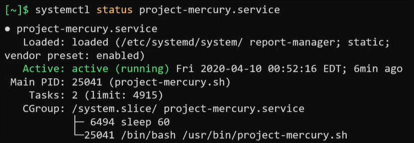
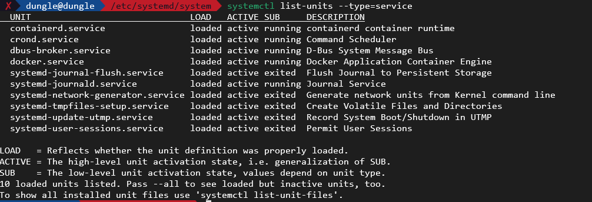
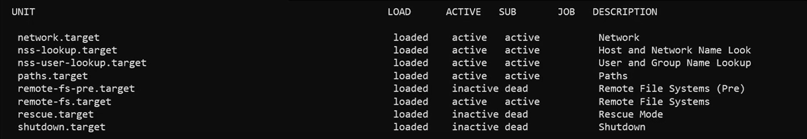
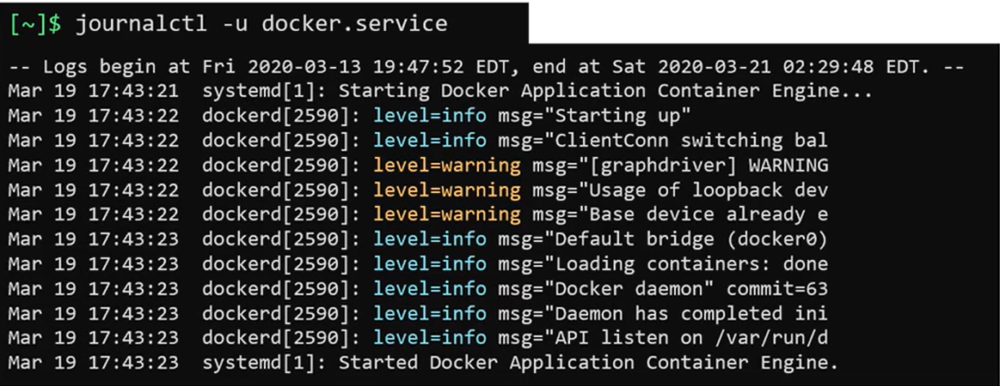

- [Service Management](#service-management)
- [Systemd Tools](#systemd-tools)

## Service Management
- When we run an application and suddenly our system crashed after the system restart, our application will not run.
- To avoid this issue, we need to run our application as a service.
- The service will run automatically when the system start and will run automatically when the system restart.
- The command to manage the service is `systemctl`.
- We have secarios: 
  - Program -`/usr/bin/project-mercury.sh` need to run automatically when the system start.
  - Start application after database finished initialize.
  - Use Service Account project_mercury to run the application.
  - Auto Restart on Failure.
  - Restart Interval 10 seconds.
- To create a service, we need to create a unit file located at `/etc/systemd/system/project-mercury.service`.
- Below are steps to build unit file to run `/usr/bin/project-mercury.sh`:
- First, we want to run the program when the system start so we need to add the [Service] section as below:
```
[Service]
ExecStart=/usr/bin/project-mercury.sh
```

- To start the service we can run command `systemctl start project-mercury.service`.
- To check status of the service we can run command `systemctl status project-mercury.service`.


- To enable the service to run during boot we need to add section `[Install]` to the unit file and run as `project_mercury` user, and restart on failure, and restart interval 10 seconds.
- The unit file will be like this:
```
[Install]
WantedBy=multi-user.target
[Service]
ExecStart=/usr/bin/project-mercury.sh
User=project_mercury
Restart=on-failure
RestartSec=10
```
- The `WantedBy=multi-user.target` means that the service will run when the system is in multi-user mode.
- The `User=project_mercury` means that the service will run as `project_mercury` user.
- The `Restart=on-failure` means that the service will restart on failure.
- The `RestartSec=10` means that the service will restart interval 10 seconds.
- To make the service depends on the PostgreSQL service, we can add `After=postgresql.service` to the unit file.
- The unit file will be like this:
```
[Unit]
Description=Project Mercury
Documentation=https://project-mercury.com
After=postgresql.service

[Install]
WantedBy=multi-user.target

[Service]
ExecStart=/usr/bin/project-mercury.sh
User=project_mercury
Restart=on-failure
RestartSec=10
```
- In the `Unit` section, we can add Description and Documentation to the service.
- To retrieve a service descript and documentation we can use command `systemctl show project-mercury.service`.
- The make the system detect the changes that we made to the unit file, we need to reload the systemd daemon by running command `systemctl daemon-reload`, this command will reload the systemd daemon and apply the changes that we made to the unit file.

## Systemd Tools
- Let's talk about some function of systemctl tools: 
  - Start/stop/restart/reload service: `systemctl start/stop/restart/reload project-mercury.service`.
  - List and manage service: `systemctl list-units --type=service`.
    
  - Reload serivce without interrupt service: `systemctl reload project-mercury.service`.
  - To make service start automatically during boot: `systemctl enable project-mercury.service`.
  - To make service not start automatically during boot: `systemctl disable project-mercury.service`.
  - Manage system state through command: `systemctl status project-mercury.service`. There're some states of the service: `Active`: service running, `inactive`: service not running, `failed`: service failed to run.
- Run command `systemctl edit project-mercury.service --full` to edit service using editor
- Get current default target: `systemctl get-default`
- Set new default target: `systemctl set-default NEW_TARGET`
- To list all unit in Linux system run command: `systemctl list-units --all`


- But if you want to only show for active Unit you should run command `systemctl list-units`
- The `journalctl` is useful when trouble issues
- To see the logs from the current boot run command: `journalctl -b`
- To see the logs from a specific unit run command: `journalctl -u UNIT_NAME` for example:
