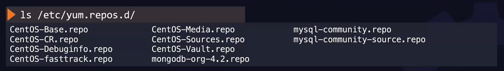

- [Create file with content](#create-file-with-content)
- [Vim basic](#vim-basic)
- [Vim Lab](#vim-lab)
  - [Which default editor are using in your linux machine](#which-default-editor-are-using-in-your-linux-machine)
- [Check what is the current user is](#check-what-is-the-current-user-is)
- [How to change the user to other ?](#how-to-change-the-user-to-other-)
- [Download file from the internet](#download-file-from-the-internet)


## Create file with content
Question create a file name `contents_file.txt` with content `This is not empty file`
```shell
cat > /home/thor/contents_file.txt <<EOF
This is not empty file
EOF
```


## Vim basic
The VI editor has two mode: 
* **Command** mode: where we can input command
* **Insert** mode: is the mode that we can input content into text file.

* **x**: Delete one character:
* **dd**: Delete one line
* **yy**: Copy
* **p**: paste
* **Ctrl + u**: scroll up
* **Ctrl + d**: scroll down
* **:** this help to input command
* **:w** helps save changes to disk
* **:w** filename save file with file name
* **/of**: to find the **of** in the file use **/** all the occurence highlighted. To move to the next occurence press **n**, press **shift** + **n** to go backward
* **d3d**: delete 3 line from the beginning. You can replace 3 with whatever number you want.


## Vim Lab

### Which default editor are using in your linux machine

```shell
update-alternatives --display editor
```
## Check what is the current user is
```shell
whoiam
```

## How to change the user to other ? 

```shell
su user_name
```
* Then you need to input password for this user.

## Download file from the internet

```shell
curl http://www.file.com/file.txt -o
# OR
wget http://www.file.com/file.txt -O output_file.txt
```

# Package Manager

* A package manager in Linux is a tool that helps you manage software packages on your system. It simplifies the process of installing, updating, configuring, and removing software. Here are some key points about package managers
* In the Centos, Red Hat Enterprice Linux or Fedora use **RPM** package manager
* To install package use command: 
```shell
rpm -i telnet.rpm
```

* To uninstall package use command
```shell
rpm -e telnet
```

* Show all packages
```shell
rpm -qa
```

* Query package
```shell
rpm -q telnet
```

* When using the rpm command to install package it doesn't install the dependencies so we need to use `yum` command instead

```shell
yum install ansible
```
* This command install `ansible` and its dependencies
* The yum command look through all repositories that contains thousands of rpm packages located in local desktop or remote server.
* When install application through yum it searchs and install packages in the right order

* To list all repositories in yourcompute use the below command:
```shell
yum repolist
```


* List all configuration of repo 
```shell
ls /etc/yum.repos.d/
```



```shell
cat /etc/yum.repos.d/CentOS-Base.repo
```


* To list all packages installed in your computer
```shell
yum list forticlient
```
* You can replace `forticlient` with whatever packages you want to search. Or omit the `forticlient` to search for all packages.


* Uninstall packages use the command 
```shell
yum remove forticlient
```

* To check the duplicate of packages in the yum repo use the command
```shell
yum --showduplicates list ansible
```


* To install specific version of ansible use the command.
```shell
yum install ansible-2.4.2.0
```

## Services
* When you have an application that you need to make sure the application can run even your servers are rebooted.

* To start service you need to run 
```shell
service httpd start
```
OR
```shell
systemctl start httpd
```

* The `httpd` is service name you want to start.

* To stop httpd service use command
```shell
systemctl stop httpd
```

* To check status of service use command 
```shell
systemctl status httpd
```

* Config httpd run at startup run command
```shell
systemctl enable httpd
```

* To stop httpd run at startup run command
```shell
systemctl disable httpd
```

* Configure program as service
* Suppose you have simple python command to run python application `/usr/bin/python3 /opt/code/my_app.py`


* The goal now is to create a service my_app so that we can run the service by using `systemctl` command.

* The systemd service config files located at `/etc/systemd/system` folder.

* Create a file named my_app.service
```linux
[Unit]
Description=My python web application

[Service]
ExecStart=/usr/bin/python3 /opt/code/my_app.py
Restart=always

[Install]
WantedBy=multi-user.target
```

The `Install` section allow the service run after multi-user.target finished boot up.
The `Description` specify the description give more information for application. What does our application do, ...
The `Restart` allow the application to automatically restart when it crashs.

* Let the systemctl daemon know there is a new service by running the command
```shell
systemctl daemon-reload
```

* Start service
```shell
systemctl start my_app
```

* Show status o sevices
```shell
systemctl status my_app
```

* To allow the application run at boot up run the command
```shell
systemctl enable my_app
```

