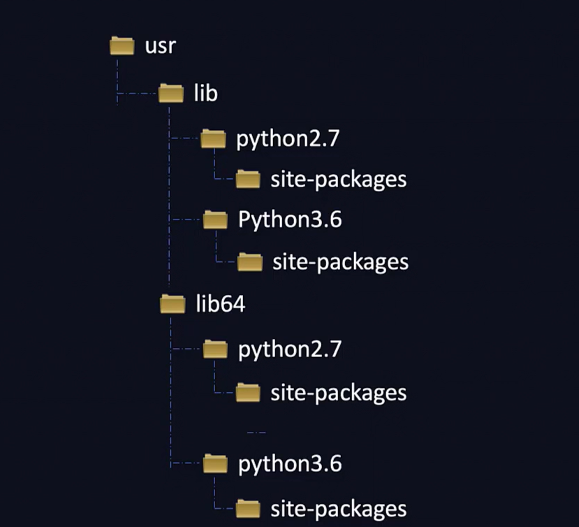
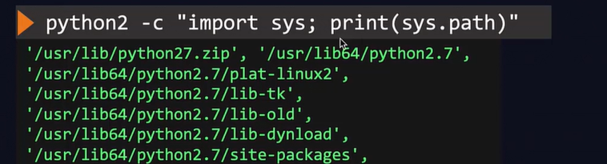
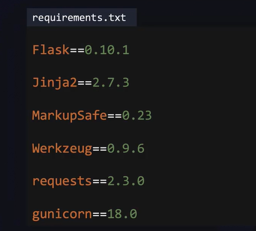
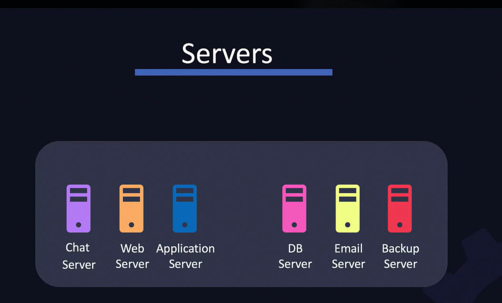
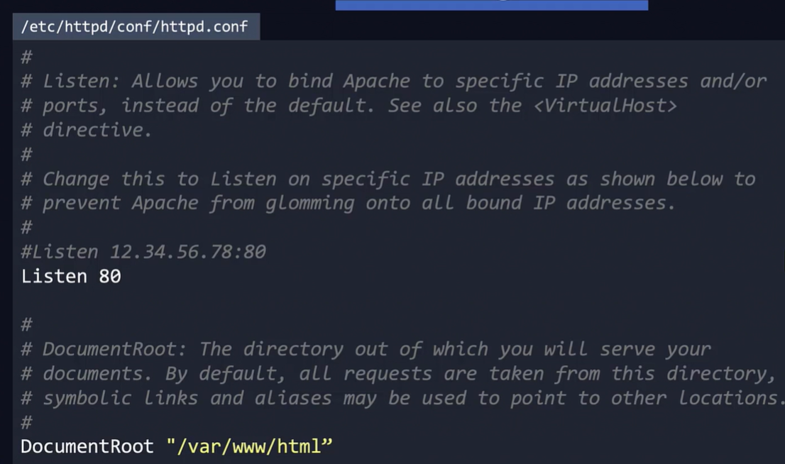
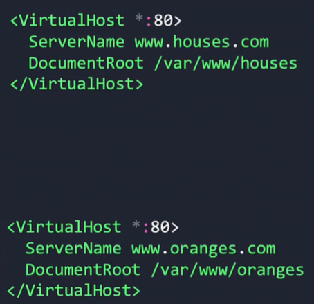
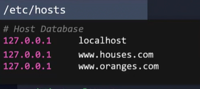
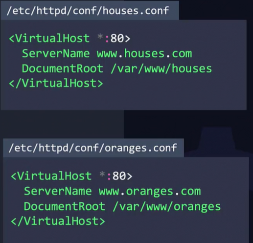

Troubleshooting installing library 



* Install dependencies from `requirements.txt` file
```bash
pip install -r requirements.txt
```



## Different type of servers
 


 ## Apache Webserver

 * Install httpd
```bash
yum install httpd -y
```  

* Start the `httpd` service
```bash
service httpd start
```

* If the system has firewall need to add firewall rule to allow http traffic
```bash
firewall-cmd --permanent --add-service=http
```
* The service has the logs file in the path
```bash
cat /var/log/httpd/access_log
```

* Access the error logs
```bash
cat /var/log/httpd/error_log
```

* The configuration file located in `/etc/httpd/conf/httpd.conf`



* To access the page navigate to `http://localhost:80`

* To enable on server to serve for multiple website we can configure VirtualHost


To test it we can configure DNS on our local system at `etc/hosts`




* Instead of having a large configuration we can have separate configuration files in the location `etc/httpd/conf/`


* When we have multiple configuration we need to have `Include` statement to include these files

```
Include conf/houses.conf
Include conf/oranges.conf
```

## Apache Tomcat
* This is a web server to host Java-based web applications.

### Installation steps
* Install Java
```bash
yum install java-1.8.0-openjdk-devel
```

* Download Tomcat webserver
```bash
wget https://downloads.apache.org/tomcat/tomcat-8/v8.5.53/bin/apache-tomcat-8.5.53.tar.gz
```

*  Extract the Tomcat
```bash
tar xvf apache-tomcat-8.5.53.tar.gz
```

* Run the apache webserver
```bash
./apache-tomcat-8.5.53/bin/startup.sh
```

* The webserver listen on the site `http://localhost:8080`


## The PM2 for deploy production grade NodeJS webserver
* To run the NodeJS app simply run the command
```bash
pm2 start app.js
```

* Start app in cluster mode run the below command
```bash
pm2 start app.js -i 4
```

Run `pm2 delete app.js` to delete pm2 fork